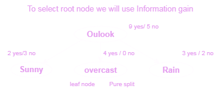

# AIML Class Notes

---


## Structure of ML:

<div style="display: flex; justify-content: center;">
<table style="text-align: center;">
  <tr>
    <th colspan="2">Supervised Learning</th>
    <th>Unsupervised Learning</th>
  </tr>
  <tr>
    <td>Classification</td>
    <td>Regression</td>
    <td>PCA</td>
  </tr>
  <tr>
    <td>Logistic Regression</td>
    <td>Linear Regression</td>
    <td>K-mean Clustering</td>
  </tr>
  <tr>
    <td>Naive Bayes</td>
    <td>Ridge Regression</td>  
    <td>Hierarchical Clustering</td>
  </tr>
  <tr>
    <td>Linear Discriminant Analysis (LDA)</td>
    <td>Lasso Regression</td>  
    <td>DB Scan Clustering</td>
  </tr>
  <tr>
    <td colspan="2" style="text-align: center;">Decision Trees</td>
    <td> </td>
  </tr>
  <tr>
    <td colspan="2">Random Forest</td>
    <td> </td>
  </tr>
  <tr>
    <td colspan="2">Support Vector Machines (SVM)</td>
    <td> </td>
  </tr>
  <tr>
    <td colspan="2">K-Nearest Neighbors (KNN)</td>
    <td> </td>
  </tr>
  <tr>
    <td colspan="2">Gradient Boosting Algorithms</td>
    <td> </td>
  </tr>
  <tr>
    <td colspan="2">Neural Networks</td>
    <td> </td>
  </tr>
</table>
</div>


---

## 29 August 2024

### Machine Learning

**Prerequisites:**
- Statistics and Probability

**Types of Machine Learning:**
1. **Supervised Learning:** 
   - Dependent (Target) and Independent (Features) variables.
2. **Unsupervised Learning:** 
   - Clustering of data.
3. **Reinforcement Learning:** 
   - Can involve both supervised and unsupervised elements. Commonly used in robotics, where the model learns through feedback from its actions.

**Types of Variables:**
1. **Numerical (Quantitative)**
2. **Categorical**
   - Unsure distinction between continuous and categorical, quantitative and qualitative, or discrete (whole numbers only).

---

## 31 August 2024

### Supervised Machine Learning

**Divided into:**
- **Regression:** Used when the target variable is continuous.
- **Classification:** Used when the target variable has a limited number of categories.

**Data Types:**
- **Training Data**
- **Testing Data**

**Types of Categorical Data:**
1. **Nominal Data**
2. **Ordinal Data**

**Note:** Check the **target (dependent variable)** to decide whether to use Regression or Classification:
- Continuous target → **Regression**
- Categorical target → **Classification**

> If the number of categories < 30 → Classification, otherwise Regression (usually decided by domain experts in companies).

---

### K-Nearest Neighbors (KNN)

**Handling Imbalanced Datasets:**
1. **Undersampling**
2. **Oversampling**
3. **SMOTE:** Synthetic Minority Over-sampling Technique to balance data by generating new samples near existing ones.

**Disadvantages of KNN:**
1. Not suitable for large datasets due to high computational complexity in calculating distances.
2. Sensitive to outliers, requiring a clean dataset.
3. Imbalanced datasets can reduce the efficiency and accuracy of the KNN algorithm.

**Distance Metrics:**
- **Euclidean Distance:** Shortest distance (based on Pythagoras' theorem).
- **Manhattan Distance:** Sum of the absolute differences along each axis.

**Train-Test Split:**
- `x_train`, `y_train`, `x_test`, `y_test`

---

## Exam Topics - 17 September 2024

**Units 1 and 2:**
- **Algorithms:** Linear Regression, KNN
- **Accuracy Metrics:** R-squared (R²) for regression, precision/recall for classification
- **Supervised, Unsupervised, and Reinforcement Learning**
- **Measures of Central Tendency:** Mean, Median, Mode
- **Types of Variables:** Numerical and Categorical, Interval Ratios
- **Statistics in Machine Learning**

---

## 17 September 2024

### Precision & R-Squared (for Regression)

1. **R-Squared (R²):**
  - Formula: 

$$
    R^2 = 1 - \left(\frac{\text{Sum of Squared Residuals}}{\text{Total Sum of Squares}}\right)
$$

  - Problem: It doesn't account for which features are relevant.

2. **Adjusted R-Squared:**
  - Formula:

$$
    \text{Adjusted } R^2 = 1 - \left(\frac{(1-R^2)(N-1)}{N-P-1}\right)
$$

  - `N`: Number of data points
  - `P`: Number of independent features

---

### Recall

**Fitting Models:**
- **Overfitting:** High train accuracy, but low test accuracy.
- **Underfitting:** Insufficient data to train the model.
- **Best Fitting:** Good accuracy for both train and test datasets.

**Errors:**
- **Bias:** Training errors.
- **Variance:** Testing errors.

---

## 18 September 2024

### Classification

| y (Actual) | ŷ (Predicted)  | 
|------------|----------------|
| 0          | 1              |
| 1          | 1              |
| 0          | 0              |
| 1          | 1              |
| 1          | 1              |
| 0          | 1              |
| 1          | 0              |
|            |                |

### Confusion Matrix:

|               | Actual 1 | Actual 0 |
|---------------|----------|----------|
| **Pred 1**    | TP = 3   | FP = 2   |
| **Pred 0**    | FN = 1   | TN = 1   |


---

### KNN for Classification and Regression

1. **KNN for Classification:**

```bash
            |
            |     *   *
            |   * *  *    0   *  0
    Graph   |     *    *  0  X
            |    0    0    0   0        
            |   0 0     0    0
            |       0      
            -------------------------
```

---

<!-- 
### `Sample PLay Tennis Dataset`

| Day  | Outlook  | Temperature | Humidity | Wind  | Play Tennis |
|------|----------|-------------|----------|-------|-------------|
| D1   | Sunny    | Hot         | High     | Weak  | No          |
| D2   | Sunny    | Hot         | High     | Strong| No          |
| D3   | Overcast | Hot         | High     | Weak  | Yes         |
| D4   | Rain     | Mild        | High     | Weak  | Yes         |
| D5   | Rain     | Cool        | Normal   | Weak  | Yes         |
| D6   | Rain     | Cool        | Normal   | Strong| No          |
| D7   | Overcast | Cool        | Normal   | Strong| Yes         |
| D8   | Sunny    | Mild        | High     | Weak  | No          |
| D9   | Sunny    | Cool        | Normal   | Weak  | Yes         |
| D10  | Rain     | Mild        | Normal   | Weak  | Yes         |
| D11  | Sunny    | Mild        | Normal   | Strong| Yes         |
| D12  | Overcast | Mild        | High     | Strong| Yes         |
| D13  | Overcast | Hot         | Normal   | Weak  | Yes         |
| D14  | Rain     | Mild        | High     | Strong| No          | -->


<!-- 
### `Gini Example`

> 

`Solution`:
> 
 -->


<!-- ```
GI(C1) = 1 - |P1.pow2 + p2.pow2|
       => 1 - |(3/6).pow2 + (3/6)Pow2 |
       => 1- |1/4 + 1/4|
       => 0.5
``` -->


<details>
<summary>Example: Choosing the Root Node by Information Gain</summary>

---

Let’s consider a small dataset to explain how to choose the root node using **Information Gain**. We'll use the **Play Tennis** dataset as an example. The dataset contains the following features:

- **Outlook**
- **Temperature**
- **Humidity**
- **Wind**

Our goal is to choose the root node by calculating the **Information Gain** for each feature and selecting the one with the highest value.

---

## Dataset

| Day  | Outlook   | Temperature | Humidity | Wind  | Play Tennis |
|------|-----------|-------------|----------|-------|-------------|
| D1   | Sunny     | Hot         | High     | Weak  | No          |
| D2   | Sunny     | Hot         | High     | Strong| No          |
| D3   | Overcast  | Hot         | High     | Weak  | Yes         |
| D4   | Rain      | Mild        | High     | Weak  | Yes         |
| D5   | Rain      | Cool        | Normal   | Weak  | Yes         |
| D6   | Rain      | Cool        | Normal   | Strong| No          |
| D7   | Overcast  | Cool        | Normal   | Strong| Yes         |
| D8   | Sunny     | Mild        | High     | Weak  | No          |
| D9   | Sunny     | Cool        | Normal   | Weak  | Yes         |
| D10  | Rain      | Mild        | Normal   | Weak  | Yes         |
| D11  | Sunny     | Mild        | Normal   | Strong| Yes         |
| D12  | Overcast  | Mild        | High     | Strong| Yes         |
| D13  | Overcast  | Hot         | Normal   | Weak  | Yes         |
| D14  | Rain      | Mild        | High     | Strong| No          |

---

## Step 1: Calculate the Entropy of the Target Variable

The target variable is **Play Tennis**, which has 9 "Yes" and 5 "No" values. The entropy H(S) is calculated as follows:

`Formula`
<!-- >  -->

$$H(S) = - p_{yes} \log_2(p_{yes}) - p_{no} \log_2(p_{no})$$


Where:
- p(yes) = 9/14
- p(no) = 5/14

$$H(S) = - \\frac{9}{14} \log_2 \\left( \\frac{9}{14} \\right) - \\frac{5}{14} \log_2 \\left( \\frac{5}{14} \\right)$$

$$H(S) ≈ -0.642 - 0.530 ≈ 1.172$$

---

## Step 2: Calculate Information Gain for Each Feature

The Information Gain for a feature is the difference between the entropy of the original set and the weighted entropy after splitting the dataset on that feature.


$$IG = H(S) - \\sum \\left( \\frac{|S_i|}{|S|} H(S_i) \\right)$$

### Feature: **Outlook**

| Outlook  | Play Tennis (Yes/No) | Proportion |
|----------|----------------------|------------|
| Sunny    | 2 Yes, 3 No           | 5/14       |
| Overcast | 4 Yes, 0 No           | 4/14       |
| Rain     | 3 Yes, 2 No           | 5/14       |

#### Entropy for Outlook:

$$H(Outlook) ≈ 0.693$$

#### Information Gain for Outlook:

$$IG(Outlook) ≈ 0.479$$

### Feature: **Temperature**

| Temperature | Play Tennis (Yes/No) | Proportion |
|-------------|----------------------|------------|
| Hot         | 2 Yes, 2 No           | 4/14       |
| Mild        | 4 Yes, 2 No           | 6/14       |
| Cool        | 3 Yes, 1 No           | 4/14       |

#### Entropy for Temperature:

$$H(Temperature) ≈ 0.911$$

#### Information Gain for Temperature:

$$IG(Temperature) ≈ 0.261$$

### Feature: **Humidity**

| Humidity | Play Tennis (Yes/No) | Proportion |
|----------|----------------------|------------|
| High     | 3 Yes, 4 No           | 7/14       |
| Normal   | 6 Yes, 1 No           | 7/14       |

#### Entropy for Humidity:

$$H(Humidity) ≈ 0.789$$

#### Information Gain for Humidity:

$$IG(Humidity) ≈ 0.383$$

### Feature: **Wind**

| Wind   | Play Tennis (Yes/No) | Proportion |
|--------|----------------------|------------|
| Weak   | 6 Yes, 2 No           | 8/14       |
| Strong | 3 Yes, 3 No           | 6/14       |

#### Entropy for Wind:

$$H(Wind) ≈ 0.892$$

#### Information Gain for Wind:

$$IG(Wind) ≈ 0.280$$

---

## Step 3: Choose the Root Node

The Information Gain values for each feature are:
- **Outlook**: 0.479
- **Temperature**: 0.261
- **Humidity**: 0.383
- **Wind**: 0.280

Since **Outlook** has the highest Information Gain, it is chosen as the root node.


</details>


---


# Unsupervised Learning

**Unsupervised learning** is a type of machine learning that involves training models using data that has no labels or specific output. The goal is to uncover hidden structures, patterns, or insights from the data. Unlike supervised learning, there is no direct feedback or target variable to guide the learning process. [><](#3-unsupervised-learning)


## `Topics under Unsupervised Learning`:
   - K-means
   - DB Scan
   - Hierarchical CLustering
   - Dimensionality Reduction


## `Examples of Unsupervised Learning`:

### K-means Clustering Example:

- `Scenario`: A retail store wants to segment its customers based on purchasing behavior. Using K-means, the store can divide customers into different groups, such as "high spenders," "bargain shoppers," and "frequent visitors."


### `Principal Component Analysis (PCA) Example:`

- `Scenario`: A genetics researcher is working with a dataset containing thousands of gene expression levels. Using PCA, the researcher can reduce the dimensionality of the data, making it easier to analyze and visualize clusters of genes.


### `Anomaly Detection in Network Security:`
- `Scenario`: A cybersecurity team uses unsupervised learning to identify unusual patterns in network traffic that could indicate a potential security breach.


### `Market Basket Analysis Using Apriori Algorithm:`
- `Scenario`: An e-commerce company uses association rules to find patterns in customers’ buying behavior. For example, if a customer buys bread and peanut butter, they are likely to buy jam as well.

## `Advantages of Unsupervised Learning`
- `No Need for Labeled Data`: Unsupervised learning does not require labels, making it useful for scenarios where labeling is expensive or impractical.
- `Finding Hidden Patterns`: It helps discover unknown patterns in the data, leading to new insights.
- `Data Exploration`: Useful for data exploration and understanding the underlying structure of the data.


<!-- 
## `Supervised Learning`

- `Two Types:` `Classification and Regression`

- `Classification`
   - Logistic Regression
   - Naive Bayes
   - Linear Discriminant Analysis (LDA)

- `Regression`
   - Linear Regression
   - Ridge Regression
   - Lasso Regression

- `Both in Classification and Regression`
   - Decision Trees
   - Random Forest
   - Support Vector Machines (SVM)
   - k-Nearest Neighbors (KNN)
   - Gradient Boosting algorithms
   - Neural Networks


## `Unsupervised Learning`

   - `Main Types`:
      - Clustering
      - Association
      - Dimensionality Reduction

   - PCA
   - K-mean Clustering
   - Hierarchical Clustering
   - DB Scan Clustering
 -->


<!-- 
| Supervised Learning                       | Unsupervised Learning                   |
|------------------------------------------|-----------------------------------------|
| Classification          Regression       | 2                                       |
|        1                     2           | Unlabeled data                          |
|        1                     2           | Discover hidden patterns or structures  |
|        1                     2           | K-means, PCA, Apriori Algorithm         |
|        1                     2           | Customer segmentation, anomaly detection|
|        1                     2           | Difficult to evaluate objectively       |  
-->


---


# 2nd Insem

## **1. Random Forest**
Random Forest is an ensemble machine learning method that builds multiple decision trees during training and merges their outputs for better accuracy and stability. [<>](#random-forest-an-overview)

#### **Types**  
- **Classification**: Predicts categorical labels.  
- **Regression**: Predicts continuous numerical values.  

#### **Formula**  
Random Forest works by averaging results or taking majority votes:  
1. **For Classification**: 

$$
\hat{y} = \text{Mode}(T_1(x), T_2(x), ..., T_n(x))
$$  

  - where $T_i(x)$ is the prediction from the $i^{th}$ decision tree.  

2. **For Regression**: 

$$
\hat{y} = \frac{1}{n} \sum_{i=1}^{n} T_i(x)
$$

- Here

  - **$\hat{y}$**: Predicted value (output)  
  - **$n$**: Number of trees in the ensemble (e.g., in a random forest)  
  - **$\sum_{i=1}^{n}$**: Summation over all $n$ trees  
  - **$T_i(x)$**: Prediction from the $i^{th}$ tree for input $x$  

This formula is used to calculate the aggregated output (e.g., by averaging or voting) from an ensemble of decision trees.

#### **Real-Life Example**  
- **Use Case**: Predicting if a loan applicant will default.  
- **Scenario**: A bank analyzes historical data (income, credit score, debt) and builds a Random Forest model to predict loan default.

#### **Code Example** (Python)
```python
from sklearn.ensemble import RandomForestClassifier
from sklearn.datasets import load_iris
from sklearn.model_selection import train_test_split

# Load dataset
data = load_iris()
X_train, X_test, y_train, y_test = train_test_split(data.data, data.target, test_size=0.2, random_state=42)

# Train model
rf = RandomForestClassifier(n_estimators=100, random_state=42)
rf.fit(X_train, y_train)

# Predict and evaluate
predictions = rf.predict(X_test)
print("Predictions:", predictions)
```

---

## **2. Decision Tree**
A Decision Tree is a flowchart-like structure where each internal node represents a feature test, each branch represents a decision outcome, and each leaf node represents a final prediction. [<>](#decision-trees)

#### **Types**  
1. **Classification Tree**: Classifies data into categories.  
2. **Regression Tree**: Predicts numerical values.  

#### **Formulas**  
**1. Entropy**:  

$$
H(S) = - \sum_{i=1}^n p_i \log_2(p_i)
$$  

- Here

  - **$H(S)$** = Entropy of the dataset $S$  
  - **$\sum_{i=1}^{n}$** = Summation over all $n$ possible classes or outcomes  
  - **$p_i$** = Proportion or probability of class $i$ in the dataset  
  - **$\log_2(p_i)$** = Logarithm base 2 of $p_i$  


**2. Gini Impurity**: 

$$
G = 1 - \sum_{i=1}^n p_i^2
$$ 

**3. Information Gain**:  

$$
IG = H(S) - \sum_{i=1}^k \frac{|S_k|}{|S|} H(S_k)
$$

- Where

  - **$IG$** = Information Gain  
  - **$H(S)$** = Entropy of the original dataset $S$  
  - **$\sum_{i=1}^{k}$** = Summation over all subsets $S_k$  
  - **$|S_k|$** = Size (number of elements) of subset $S_k$  
  - **$|S|$** = Size (number of elements) of the original dataset $S$  
  - **$\frac{|S_k|}{|S|}$** = Proportion of subset $S_k$ in the original dataset $S$  
  - **$H(S_k)$** = Entropy of subset $S_k$  


#### **Real-Life Example**  
- **Use Case**: Approving credit card applications.  
- **Scenario**: A bank uses historical data (age, income, etc.) and builds a decision tree to automate credit card approval decisions.

#### **Code Example** (Python)
```python
from sklearn.tree import DecisionTreeClassifier
from sklearn.datasets import load_iris
from sklearn.model_selection import train_test_split

# Load dataset
data = load_iris()
X_train, X_test, y_train, y_test = train_test_split(data.data, data.target, test_size=0.2, random_state=42)

# Train model
dt = DecisionTreeClassifier(criterion="entropy", random_state=42)
dt.fit(X_train, y_train)

# Predict and evaluate
predictions = dt.predict(X_test)
print("Predictions:", predictions)
```

---

## **3. Unsupervised Learning**
Unsupervised learning algorithms learn patterns from unlabeled data. [<>](#Unsupervised-Learning)

#### **3.1 K-Means Clustering**
An algorithm that partitions data into $k$ clusters based on the proximity of data points to centroids. [<>](#k-means-clustering)

#### **Formula**  
Objective function (Minimize within-cluster variance):  

$$
J = \sum_{i=1}^k \sum_{x \in C_i} ||x - \mu_i||^2
$$

- Here

  - **$J$** = Objective function (sum of squared errors)  
  - **$\sum_{i=1}^{k}$** = Summation over all $k$ clusters  
  - **$\sum_{x \in C_i}$** = Summation over all data points $x$ in cluster $C_i$  
  - **$x$** = A data point  
  - **$C_i$** = Cluster $i$  
  - **$\mu_i$** = Centroid of cluster $C_i$  
  - **$\|x - \mu_i\|^2$** = Squared Euclidean distance between $x$ and $\mu_i$

**2. Distance Metrics** The most common distance metric used in K-Means Clustering is **Euclidean distance** :

$$
 \text{Distance} = \sqrt{\sum_{i=1}^n (x_i - y_i)^2} 
$$


#### **Real-Life Example**  
- **Use Case**: Customer segmentation in marketing.  
- **Scenario**: Group customers based on age, spending, and income.

#### **Code Example**  
```python
from sklearn.cluster import KMeans
import numpy as np

# Sample data
data = np.array([[150, 50], [160, 55], [170, 65], [180, 70], [155, 52], [165, 60]])

# Train model
kmeans = KMeans(n_clusters=2, random_state=42)
kmeans.fit(data)

# Get labels and centroids
print("Labels:", kmeans.labels_)
print("Centroids:", kmeans.cluster_centers_)
```

---

#### **3.2 DBSCAN**

Density-Based Spatial Clustering of Applications with Noise. Groups points close to each other based on density, ignoring noise. [<>](#dbscan)

### Formula/Method for determining whether a point is a **core point**:
A point $p$ is a **core point** if the number of points $N(p, \epsilon)$ within the **ε**-radius of $p$ (including $p$ itself) is greater than or equal to **MinPts**.

$$
|N(p, \epsilon)| \geq \text{MinPts}
$$

Where:
- $N(p, \epsilon)$ is the set of points within the **ε**-radius of point $p$.
- $|N(p, \epsilon)|$ is the number of points in the neighborhood of $p$.

#### **Real-Life Example**  
- **Use Case**: Identifying geographic hotspots for crimes.  
- **Scenario**: Detect dense regions of crime in city data to allocate police resources.

#### **Code Example**  
```python
from sklearn.cluster import DBSCAN
import numpy as np

# Sample data
data = np.array([[1, 2], [2, 3], [2, 2], [8, 8], [8, 9], [25, 80]])

# Train model
dbscan = DBSCAN(eps=3, min_samples=2)
dbscan.fit(data)

print("Labels:", dbscan.labels_)
```

---

#### **3.3 Hierarchical Clustering**
A clustering algorithm that creates a dendrogram representing nested groupings of data points. [<>](#hierarchical-clustering)

#### **Real-Life Example**  
- **Use Case**: Analyzing genetic similarities.  
- **Scenario**: Grouping species based on DNA similarity.

#### **Code Example**  
```python
from scipy.cluster.hierarchy import dendrogram, linkage
import matplotlib.pyplot as plt
import numpy as np

# Sample data
data = np.array([[1, 2], [2, 3], [2, 2], [8, 8], [8, 9]])

# Perform clustering
linked = linkage(data, method='ward')

# Plot dendrogram
dendrogram(linked)
plt.show()
```

---

## **4. Dimensionality Reduction**

A technique to reduce the number of features in a dataset while retaining meaningful information.

#### **Types**  
1. **PCA (Principal Component Analysis)**: Transforms data to a new set of axes.  
2. **t-SNE**: For visualization of high-dimensional data.  
3. **LDA (Linear Discriminant Analysis)**: Optimized for classification tasks.

#### **Formula for PCA**  

$$
Z = XW
$$  

  - Where $W$ is the matrix of eigenvectors.

#### **Real-Life Example**  
- **Use Case**: Visualizing customer preferences.  
- **Scenario**: Compressing 100+ customer attributes into 2 dimensions for analysis.

#### **Code Example** (PCA)
```python
from sklearn.decomposition import PCA
import numpy as np

# Sample data
data = np.array([[2.5, 2.4], [0.5, 0.7], [2.2, 2.9], [1.9, 2.2], [3.1, 3.0]])

# Apply PCA
pca = PCA(n_components=1)
reduced_data = pca.fit_transform(data)

print("Reduced Data:", reduced_data)
```
$$
\Large \text{2nd Insem Ends Here}
$$


---
---
---


# Refresher Starts

## Machine Learning: Supervised vs. Unsupervised Learning

### 1. Supervised Learning


Supervised learning is a type of machine learning where the model is trained using labeled data. The algorithm learns the mapping function from the input data to the output labels, with the goal of making accurate predictions on unseen data.

---

### Key Concepts

- **Training Data:** Labeled dataset used to train the model. Each example consists of an input-output pair.
- **Target Variable:** The output that the model is trained to predict.
- **Objective:** Minimize the error between the predicted and actual outputs using techniques like regression and classification.

---

### Types of Supervised Learning

1. **Classification:**
   - **Purpose:** Predict a discrete label.
   - **Examples:** 
     - Email spam detection (spam or not spam)
     - Image recognition (cat, dog, car)
   - **Algorithms:**
     - Decision Trees
     - Support Vector Machines (SVM)
     - Logistic Regression
     - k-Nearest Neighbors (k-NN)

2. **Regression:**
   - **Purpose:** Predict a continuous value.
   - **Examples:**
     - Predicting house prices
     - Forecasting stock prices
   - **Algorithms:**
     - Linear Regression
     - Polynomial Regression
     - Random Forest Regression

---

### Applications

- **Medical Diagnosis:** Predicting the presence of diseases based on symptoms.
- **Finance:** Credit scoring to determine loan eligibility.
- **Marketing:** Predicting customer churn and targeted advertising.
- **Speech Recognition:** Translating spoken language into text.

---

### Advantages

- **High Accuracy:** With quality labeled data, supervised models can achieve high predictive accuracy.
- **Interpretable:** Many algorithms, like linear regression, are easy to understand and interpret.
- **Versatile:** Can be applied to a wide range of real-world problems.

### Challenges

- **Data Dependency:** Requires large amounts of labeled data, which can be expensive and time-consuming to obtain.
- **Overfitting:** The model may perform well on training data but poorly on unseen data if it is too complex.
- **Limited by Labels:** Performance is constrained by the quality and quantity of the labeled data.

---

## 2. Unsupervised Learning

### Definition
Unsupervised learning involves training models on data that has no labels. The goal is to identify patterns, group similar data points, or reduce data dimensionality without any specific guidance.

---

### Key Concepts

- **Training Data:** Unlabeled dataset used to uncover hidden structures.
- **Objective:** Learn the underlying distribution or structure of the data.

---

### Types of Unsupervised Learning

1. **Clustering:**
   - **Purpose:** Group similar data points into clusters.
   - **Examples:**
     - Customer segmentation for targeted marketing
     - Document classification
   - **Algorithms:**
     - K-means Clustering
     - Hierarchical Clustering
     - DBSCAN (Density-Based Spatial Clustering of Applications with Noise)

2. **Dimensionality Reduction:**
   - **Purpose:** Reduce the number of features while preserving as much information as possible.
   - **Examples:**
     - Image compression
     - Visualizing high-dimensional data
   - **Algorithms:**
     - Principal Component Analysis (PCA)
     - t-Distributed Stochastic Neighbor Embedding (t-SNE)
     - Autoencoders

3. **Anomaly Detection:**
   - **Purpose:** Identify data points that deviate from the normal pattern.
   - **Examples:**
     - Fraud detection in credit card transactions
     - Intrusion detection in network security
   - **Algorithms:**
     - Isolation Forest
     - Gaussian Mixture Models (GMM)
     - Local Outlier Factor (LOF)

4. **Association Rule Learning:**
   - **Purpose:** Find relationships between variables in large datasets.
   - **Examples:**
     - Market basket analysis (e.g., "Customers who buy bread also buy butter")
   - **Algorithms:**
     - Apriori Algorithm
     - Eclat Algorithm

---

### Applications

- **Market Segmentation:** Understanding customer groups for personalized marketing.
- **Data Compression:** Reducing file sizes in multimedia applications.
- **Anomaly Detection:** Identifying outliers in manufacturing processes or network security.
- **Recommendation Systems:** Grouping similar items or users for content recommendations.

---

### Advantages

- **No Need for Labeled Data:** Useful when labeled data is unavailable or expensive to collect.
- **Data Exploration:** Helps in understanding the structure and patterns in the data.
- **Versatility:** Applicable to various fields, including image processing, genetics, and natural language processing.

### Challenges

- **Interpretability:** Results are often difficult to interpret, especially with complex data.
- **Evaluation Metrics:** There is no definitive way to measure the performance of the model.
- **Scalability:** Some algorithms may struggle with very large datasets.

---

## Key Differences Between Supervised and Unsupervised Learning

| Aspect                    | Supervised Learning                       | Unsupervised Learning                   |
|---------------------------|-------------------------------------------|-----------------------------------------|
| **Data Type**             | Labeled data                              | Unlabeled data                          |
| **Objective**             | Make predictions or classifications       | Discover hidden patterns or structures  |
| **Algorithms**            | Linear Regression, SVM, Decision Trees    | K-means, PCA, Apriori Algorithm         |
| **Applications**          | Email filtering, loan prediction          | Customer segmentation, anomaly detection|
| **Evaluation**            | Measured using metrics like accuracy      | Difficult to evaluate objectively       |

---

## Conclusion

Both supervised and unsupervised learning have unique strengths and are used in different scenarios. Supervised learning is effective when labeled data is available, while unsupervised learning is valuable for exploring and understanding unlabeled data.


---


## Workflow of Data Science:

- **Data Collection**: Gather data from various sources.
- **Data Cleaning**: Remove inconsistencies and missing values.
- **Exploratory Data Analysis (EDA)**: Summarize main characteristics using plots.
- **Feature Engineering**: Create meaningful features for the model.
- **Model Training**: Use ML/DL algorithms.
- **Model Evaluation**: Check performance metrics.
- **Deployment**: Deploy the model in real-world scenarios.


# End Sem

## **K-Nearest Neighbors (KNN)**

KNN is a supervised learning algorithm used for classification and regression tasks. It predicts the class or value of a data point based on the majority class or average value of its nearest neighbors.


#### **2. How KNN Works**
1. Choose the number of neighbors ($k$).
2. Calculate the distance between the data point and all other points in the dataset (e.g., Euclidean distance, Manhattan distance).
3. Identify the $k$ nearest neighbors based on the calculated distances.
4. **For Classification**:
   - Assign the class that is most common among the $k$ neighbors (majority voting).
5. **For Regression**:
   - Predict the average value of the $k$ neighbors.

---

#### **3. Types of KNN**
1. **Weighted KNN**:
   - Assigns weights to neighbors based on their distance. Closer neighbors have higher weights.
   - Useful when closer neighbors are more relevant than farther ones.
2. **Regular KNN**:
   - Treats all neighbors equally regardless of their distance.
3. **Distance Metrics**:
   - **Euclidean Distance**: Straight-line distance (default metric).
   - **Manhattan Distance**: Sum of absolute differences (useful for grid-like data).
   - **Minkowski Distance**: Generalization of Euclidean and Manhattan distances.

Here are the formulas for the distance metrics used in **K-Nearest Neighbors (KNN)**:


### **1. Euclidean Distance**  
- **Definition**: The straight-line distance between two points in n-dimensional space.  
- **Formula**:  

$$
d(p, q) = \sqrt{\sum_{i=1}^n (p_i - q_i)^2}
$$  

- $p, q$: Two points in n-dimensional space.
- $p_i, q_i$: The ith dimension of the points $p$ and $q$.

#### Example:
For $p = (2, 3)$ and $q = (5, 7)$: 

$$
d(p, q) = \sqrt{(2 - 5)^2 + (3 - 7)^2} = \sqrt{9 + 16} = 5
$$

---

### **2. Manhattan Distance**  
- **Definition**: The sum of absolute differences between the coordinates of two points.  
- **Formula**:  

$$
d(p, q) = \sum_{i=1}^n |p_i - q_i|
$$  

#### Example:
For $p = (2, 3)$ and $q = (5, 7)$:  

$$
d(p, q) = |2 - 5| + |3 - 7| = 3 + 4 = 7
$$

---

### **3. Minkowski Distance**  
- **Definition**: A generalized distance metric that combines both Euclidean and Manhattan distances, controlled by a parameter $p$.  
- **Formula**: 

$$
d(p, q) = \left( \sum_{i=1}^n |p_i - q_i|^p \right)^{\frac{1}{p}}
$$ 

- $p = 2$: Euclidean Distance.
- $p = 1$: Manhattan Distance.

#### Example:
For $p = (2, 3)$ and $q = (5, 7)$, with $p=3$:  

$$
d(p, q) = \left( |2 - 5|^3 + |3 - 7|^3 \right)^{\frac{1}{3}} = \left( 27 + 64 \right)^{\frac{1}{3}} = \sqrt[3]{91} \approx 4.497
$$

---

### **4. Cosine Similarity** (Often used for text or high-dimensional data)  
- **Definition**: Measures the cosine of the angle between two vectors, indicating their orientation similarity rather than magnitude.  
- **Formula**:

$$
\text{Cosine Similarity} = \frac{\sum_{i=1}^n p_i \cdot q_i}{\sqrt{\sum_{i=1}^n p_i^2} \cdot \sqrt{\sum_{i=1}^n q_i^2}}
$$ 

- **Cosine Distance**:  

$$
\text{Cosine Distance} = 1 - \text{Cosine Similarity}
$$

#### Example:
For $p = (1, 0, -1)$ and $q = (-1, 0, 1)$: 

$$
\text{Cosine Similarity} = \frac{(1)(-1) + (0)(0) + (-1)(1)}{\sqrt{1^2 + 0^2 + (-1)^2} \cdot \sqrt{(-1)^2 + 0^2 + 1^2}} = \frac{-1 - 1}{\sqrt{2} \cdot \sqrt{2}} = -1
$$

---


#### **4. Scenarios**
1. **Classification**:
   - Image recognition (e.g., classify handwritten digits).
   - Medical diagnosis (e.g., classify patients into disease categories).
2. **Regression**:
   - Predict house prices based on nearby properties.
   - Estimate weather conditions based on nearby stations.


---

#### **7. Coding Example**
Here’s an example of KNN for classification using Python and the `scikit-learn` library:

```python
from sklearn.datasets import load_iris
from sklearn.model_selection import train_test_split
from sklearn.preprocessing import StandardScaler
from sklearn.neighbors import KNeighborsClassifier
from sklearn.metrics import accuracy_score

# Load dataset
data = load_iris()
X, y = data.data, data.target

# Split data into train and test sets
X_train, X_test, y_train, y_test = train_test_split(X, y, test_size=0.2, random_state=42)

# Standardize features
scaler = StandardScaler()
X_train = scaler.fit_transform(X_train)
X_test = scaler.transform(X_test)

# Initialize and train KNN model
k = 3
model = KNeighborsClassifier(n_neighbors=k)
model.fit(X_train, y_train)

# Predict and evaluate
y_pred = model.predict(X_test)
print("Accuracy:", accuracy_score(y_test, y_pred))
```
---

`Regresion - Predicting house price`

```python
from sklearn.datasets import make_regression
from sklearn.model_selection import train_test_split
from sklearn.preprocessing import StandardScaler
from sklearn.neighbors import KNeighborsRegressor
from sklearn.metrics import mean_squared_error

# Generate synthetic regression dataset
X, y = make_regression(n_samples=100, n_features=1, noise=20, random_state=42)

# Split data into train and test sets
X_train, X_test, y_train, y_test = train_test_split(X, y, test_size=0.2, random_state=42)

# Standardize features
scaler = StandardScaler()
X_train = scaler.fit_transform(X_train)
X_test = scaler.transform(X_test)

# Initialize and train KNN Regressor
k = 3  # Number of neighbors
knn_regressor = KNeighborsRegressor(n_neighbors=k)
knn_regressor.fit(X_train, y_train)

# Predict on the test set
y_pred = knn_regressor.predict(X_test)

# Evaluate the model
mse = mean_squared_error(y_test, y_pred)
print("Mean Squared Error:", mse)

# Compare actual vs predicted values for first 5 test samples
print("Actual:", y_test[:5])
print("Predicted:", y_pred[:5])
```

---

#### **5. Advantages**
- Simple and easy to implement.
- No assumptions about the data distribution.
- Effective for smaller datasets with low dimensionality.

#### **6. Disadvantages**
- Computationally expensive for large datasets.
- Sensitive to irrelevant features and data scaling.
- Requires careful choice of $k$ (too small may lead to noise, too large may oversimplify).

---

#### **8. Key Points**
- **Choice of $k$**:
  - Use cross-validation to select the optimal $k$.
  - Common practice: Start with $k = \sqrt{n}$, where $n$ is the number of data points.
- **Data Preprocessing**:
  - Standardize or normalize features to avoid bias due to large-scale differences.
- **Distance Metrics**:
  - Choose the metric based on data characteristics and domain knowledge.


#### **9. Conclusion**
KNN is a powerful yet simple algorithm for classification and regression. While it is computationally intensive for large datasets, proper preprocessing, feature selection, and choosing an optimal $k$ can significantly improve its performance.

---

## Decision Tree

A Decision Tree is a flowchart-like structure where each internal node represents a feature test, each branch represents a decision outcome, and each leaf node represents a final prediction. [<>](#decision-trees)

#### **Types**  
1. **Classification Tree**: Classifies data into categories.  
2. **Regression Tree**: Predicts numerical values.  

#### **Formulas**  
**1. Entropy**:  

$$
H(S) = - \sum_{i=1}^n p_i \log_2(p_i)
$$  

- Here

  - **$H(S)$** = Entropy of the dataset $S$  
  - **$\sum_{i=1}^{n}$** = Summation over all $n$ possible classes or outcomes  
  - **$p_i$** = Proportion or probability of class $i$ in the dataset  
  - **$\log_2(p_i)$** = Logarithm base 2 of $p_i$  


**2. Gini Impurity**: 

$$
G = 1 - \sum_{i=1}^n p_i^2
$$ 

**3. Information Gain**:  

$$
IG = H(S) - \sum_{i=1}^k \frac{|S_k|}{|S|} H(S_k)
$$

- Where

  - **$IG$** = Information Gain  
  - **$H(S)$** = Entropy of the original dataset $S$  
  - **$\sum_{i=1}^{k}$** = Summation over all subsets $S_k$  
  - **$|S_k|$** = Size (number of elements) of subset $S_k$  
  - **$|S|$** = Size (number of elements) of the original dataset $S$  
  - **$\frac{|S_k|}{|S|}$** = Proportion of subset $S_k$ in the original dataset $S$  
  - **$H(S_k)$** = Entropy of subset $S_k$  





#### **Real-Life Example**  
- **Use Case**: Approving credit card applications.  
- **Scenario**: A bank uses historical data (age, income, etc.) and builds a decision tree to automate credit card approval decisions.

#### **Code Example** (Python)
```python
from sklearn.tree import DecisionTreeClassifier
from sklearn.datasets import load_iris
from sklearn.model_selection import train_test_split

# Load dataset
data = load_iris()
X_train, X_test, y_train, y_test = train_test_split(data.data, data.target, test_size=0.2, random_state=42)

# Train model
dt = DecisionTreeClassifier(criterion="entropy", random_state=42)
dt.fit(X_train, y_train)

# Predict and evaluate
predictions = dt.predict(X_test)
print("Predictions:", predictions)
```
---

## Random Forest


**Random Forest**  is an ensemble learning method used for both classification and regression tasks. It operates by constructing multiple decision trees during training and outputs the average prediction (regression) or the majority vote (classification) of the individual trees.  [><](#1-random-forest)

### How Does Random Forest Work? 
 
1. **Bootstrap Sampling** :
  - The algorithm creates several subsets of the original dataset using sampling with replacement. Each subset is used to train an individual decision tree.
 
2. **Feature Selection** :
  - When building each decision tree, a random subset of features is chosen for splitting at each node. This introduces more diversity among trees and helps to reduce overfitting.
 
3. **Tree Construction** :
  - Each decision tree is grown to its maximum depth without pruning. The trees may become highly specialized and overfit the training data individually.
 
4. **Prediction Aggregation** : 
  - **For Classification** : Each tree votes for a class, and the class with the most votes becomes the model's prediction.
 
  - **For Regression** : The predictions of all trees are averaged to get the final output.


---


### Key Concepts 
 
1. **Ensemble Learning** :
  - Random Forest is based on the concept of ensemble learning, where multiple models (decision trees) are combined to improve overall performance.
 
2. **Bagging (Bootstrap Aggregating)** :
  - This technique helps in reducing variance and improving the stability of the model by training each tree on a random subset of the data.
 
3. **Feature Randomness** :
  - Introducing randomness in the feature selection reduces correlation among trees, further enhancing model generalization.


---


### Hyperparameters in Random Forest 
 
1. **Number of Trees (`n_estimators`)** :
  - The number of decision trees to be built. A higher number generally improves performance but increases training time.
 
2. **Maximum Depth (`max_depth`)** :
  - The maximum depth of each tree. Controlling this can help in avoiding overfitting.
 
3. **Minimum Samples Split (`min_samples_split`)** :
  - The minimum number of samples required to split a node. Increasing this can prevent overfitting.
 
4. **Minimum Samples Leaf (`min_samples_leaf`)** :
  - The minimum number of samples required to be at a leaf node. Higher values can smooth the model.
 
5. **Maximum Features (`max_features`)** :
  - The maximum number of features considered for splitting a node. It introduces randomness and helps in reducing overfitting.

<!-- </img> -->

---


<!-- ==================================================================================== -->

### Random Forest Classification and Regression Examples

#### **1. Random Forest for Classification**

`Examlple`: Predict the species of a flower based on its features using the Iris dataset.

```python
# Import libraries
from sklearn.ensemble import RandomForestClassifier
from sklearn.datasets import load_iris
from sklearn.model_selection import train_test_split
from sklearn.metrics import accuracy_score

# Load the Iris dataset
data = load_iris()
X = data.data  # Features
y = data.target  # Labels

# Split data into training and testing sets
X_train, X_test, y_train, y_test = train_test_split(X, y, test_size=0.2, random_state=42)

# Create and train the Random Forest Classifier
clf = RandomForestClassifier(n_estimators=100, random_state=42)
clf.fit(X_train, y_train)

# Make predictions
y_pred = clf.predict(X_test)

# Evaluate the model
accuracy = accuracy_score(y_test, y_pred)
print(f"Classification Accuracy: {accuracy * 100:.2f}%")
```

---

#### **2. Random Forest for Regression**

`Example`: Predict house prices based on features like location and size using the California Housing dataset.

```python
# Import libraries
from sklearn.ensemble import RandomForestRegressor
from sklearn.datasets import fetch_california_housing
from sklearn.model_selection import train_test_split
from sklearn.metrics import mean_squared_error

# Load the California Housing dataset
data = fetch_california_housing()
X = data.data  # Features
y = data.target  # Labels

# Split data into training and testing sets
X_train, X_test, y_train, y_test = train_test_split(X, y, test_size=0.2, random_state=42)

# Create and train the Random Forest Regressor
reg = RandomForestRegressor(n_estimators=100, random_state=42)
reg.fit(X_train, y_train)

# Make predictions
y_pred = reg.predict(X_test)

# Evaluate the model
mse = mean_squared_error(y_test, y_pred)
print(f"Mean Squared Error: {mse:.2f}")
```
---

### Explanation of What Was Done:
1. **Data Loading:** Loaded datasets (`Iris` for classification, `California Housing` for regression).
2. **Data Splitting:** Divided data into training and testing sets (80-20 split).
3. **Model Training:** Built and trained a Random Forest model with 100 decision trees.
4. **Prediction:** Predicted outcomes (flower species or house prices) on the test set.
5. **Evaluation:** Measured performance using accuracy (classification) and MSE (regression).

---

### Explanation of Key Parameters
1. **n_estimators**: Number of decision trees in the forest.
2. **random_state**: Ensures reproducibility of results.
3. **train_test_split**: Divides data into training and testing sets.
4. **accuracy_score** (classification) and **mean_squared_error** (regression): Metrics for evaluating performance.

---

### Applications of Random Forest 
 
- **Medical Diagnosis** : Identifying diseases based on various symptoms and medical history.
 
- **Finance** : Credit scoring, fraud detection, and stock price prediction.
 
- **Image and Speech Recognition** : Classification tasks where high accuracy is crucial.
 
- **E-commerce** : Customer segmentation, product recommendation, and sentiment analysis.


---


### Advantages of Random Forest 
 
- **Reduced Overfitting** : By averaging the results of multiple trees, the model becomes less likely to overfit the training data compared to individual decision trees.
 
- **Handles Missing Data** : It can maintain accuracy even when a significant portion of the data is missing.
 
- **Robust to Noise** : It is relatively robust to outliers and noise in the data.
 
- **Feature Importance** : Provides a way to evaluate the importance of each feature in making predictions.


---


### Disadvantages of Random Forest 
 
- **Computational Complexity** : Training multiple trees can be time-consuming, especially with large datasets.
 
- **Memory Usage** : It can require substantial memory due to the large number of decision trees.
 
- **Less Interpretability** : Compared to individual decision trees, understanding and interpreting a random forest model can be challenging.

---


### Q. Compare and contrast Decision Trees and Random Forests in terms of performance and accuracy.

Decision Trees and Random Forests are popular machine learning algorithms, but they differ significantly in terms of performance, accuracy, and robustness. Below is a structured comparison:


### **1. Overview**  

| Aspect              | Decision Tree                                    | Random Forest                                 |
|---------------------|--------------------------------------------------|-----------------------------------------------|
| **Definition**      | A tree-like structure where nodes represent features, branches represent decisions, and leaf nodes represent outcomes. | An ensemble of decision trees built using bagging to improve performance and robustness. |
| **Key Idea**        | Single model working on the entire dataset.       | Combines predictions from multiple decision trees. |

### **2. Performance Comparison**  

#### **(a) Accuracy**  
- **Decision Trees**:  
  - High tendency to overfit the training data, especially when the tree is deep.  
  - Accuracy decreases on test data due to overfitting.  
  - Sensitive to noisy or irrelevant features.  

- **Random Forests**:  
  - Higher accuracy due to the aggregation of multiple trees.  
  - Overcomes overfitting by combining results of multiple trees.  
  - Robust to noise and irrelevant features.  

#### **(b) Computational Complexity**  
- **Decision Trees**:  
  - Faster to train because only one tree is built.  
  - Training time grows with dataset size but is generally efficient.  

- **Random Forests**:  
  - Slower to train due to the creation of multiple trees.  
  - Prediction is slower as it requires aggregation from multiple trees.  

### **3. Strengths and Weaknesses**  

#### **(a) Interpretability**  
- **Decision Trees**:  
  - Easy to interpret and visualize due to their simple structure.  
  - Suitable for explaining model predictions to non-technical stakeholders.  

- **Random Forests**:  
  - Difficult to interpret due to the aggregation of many trees.  
  - Acts more like a "black box" model.  

#### **(b) Robustness to Overfitting**  
- **Decision Trees**:  
  - Highly prone to overfitting, especially for noisy data.  
  - Can be controlled using pruning techniques.  

- **Random Forests**:  
  - Reduces overfitting significantly by averaging the outputs of multiple trees.  
  - Better generalization on unseen data.  

### **4. When to Use**  

| Scenario                      | Decision Tree                           | Random Forest                                |
|-------------------------------|-----------------------------------------|---------------------------------------------|
| **Small Datasets**            | Suitable due to faster training.        | Overkill for small datasets.                |
| **High Dimensional Data**     | Struggles with noise and irrelevant features. | Handles high-dimensional data effectively by random feature selection. |
| **Need for Interpretability** | Preferred due to simplicity.            | Not preferred; harder to explain.           |
| **Large Datasets with Noise** | May overfit and perform poorly.         | Performs well due to robustness.            |


### Summary:
- Random Forests work well for both **classification** and **regression** problems.
- Tuning hyperparameters (e.g., `max_depth`, `min_samples_split`) can further improve performance.


---


## K-Means Clustering
[Refresher for K-Means Clustering](https://youtu.be/CLKW6uWJtTc?si=oU2h6lLe_fS9XDX1)

**K-Means** Clustering is a popular **unsupervised learning**  algorithm used for **partitioning data**  into a specified number of clusters (K). The goal is to group data points into clusters such that points in the same cluster are more similar to each other than to those in other clusters. The algorithm iteratively refines the cluster centers (centroids) to minimize the sum of squared distances between each point and its nearest centroid. [><](#31-k-means-clustering)

**1. How K-Means Clustering Works** 
The K-Means algorithm follows these steps:
 
1. **Choose the Number of Clusters (K)** :
  - Decide the number of clusters, K.
  - This is a hyperparameter that needs to be chosen in advance.
 
2. **Initialize Centroids** :
  - Randomly select K data points as initial cluster centroids.
 
3. **Assign Data Points to Clusters** :
  - For each data point, calculate its distance to each centroid.
  - Assign the point to the cluster with the nearest centroid.
 
4. **Update Centroids** :
  - Calculate the new centroids as the mean of all points assigned to each cluster.
 
5. **Repeat** :
  - Repeat the assignment and update steps until the centroids no longer change significantly or a maximum number of iterations is reached.
 
6. **Converge** :
  - The algorithm stops when the centroids stabilize.


**2. Distance Metrics** The most common distance metric used in K-Means Clustering is **Euclidean distance** :

$$
 \text{Distance} = \sqrt{\sum_{i=1}^n (x_i - y_i)^2} 
$$


**3. Example of K-Means Clustering in Python** 

```python
import numpy as np
import matplotlib.pyplot as plt
from sklearn.cluster import KMeans
from sklearn.datasets import make_blobs

# Generate synthetic data
X, _ = make_blobs(n_samples=300, centers=4, cluster_std=0.6, random_state=42)

# Apply K-Means with K=4
kmeans = KMeans(n_clusters=4, random_state=42)
kmeans.fit(X)
y_kmeans = kmeans.predict(X)

# Plot the results
plt.scatter(X[:, 0], X[:, 1], c=y_kmeans, cmap='viridis', marker='o', edgecolor='k')
plt.scatter(kmeans.cluster_centers_[:, 0], kmeans.cluster_centers_[:, 1], s=300, c='red', marker='X')
plt.title("K-Means Clustering")
plt.xlabel("Feature 1")
plt.ylabel("Feature 2")
plt.show()
```
**Explanation** : 
  - **`make_blobs`**  generates a dataset with four distinct clusters.
  - **`KMeans`**  is used to fit the model and assign cluster labels.
  - **`cluster_centers_`**  provides the coordinates of the centroids.


**4. Choosing the Number of Clusters (K)** 
Selecting the right value of K is crucial for effective clustering. Common methods include:
 
1. **Elbow Method** :
  - Plot the sum of squared errors (SSE) for different values of K.
  - The optimal K is often where the SSE starts to decrease more slowly (the "elbow").

$$
 \text{SSE} = \sum_{i=1}^{n} \|x_i - c_j\|^2 
$$
 
2. **Silhouette Score** :
  - Measures how similar a point is to its own cluster compared to other clusters.
  - A higher score indicates better clustering.


**5. Advantages of K-Means Clustering**  

  - **Simple and easy to implement** . 
  - **Scales well**  to large datasets. 
  - Efficient with a time complexity of $O(n \cdot k \cdot i)$, where n is the number of data points, k is the number of clusters, and i is the number of iterations.


**6. Disadvantages of K-Means Clustering**  
  - **Requires specification of K** : The number of clusters must be chosen beforehand. 
  - **Sensitive to initial centroids** : Poor initialization can lead to suboptimal clustering. 
  - **Assumes spherical clusters** : Struggles with non-spherical cluster shapes. 
  - **Not robust to noise and outliers** : Outliers can significantly affect the centroids.


**7. Limitations and Solutions**  
1. **Limitation** : K-Means is sensitive to the initial placement of centroids. 
  - **Solution** : Use the **K-Means++ initialization** , which selects initial centroids in a smart way to speed up convergence and improve accuracy.
 
2. **Limitation** : Struggles with clusters of varying densities or non-spherical shapes. 
  - **Solution** : Use density-based clustering algorithms like **DBSCAN**  or hierarchical clustering.


**8. Applications of K-Means Clustering**  
  - **Customer Segmentation** : Grouping customers based on purchasing behavior. 
  - **Image Compression** : Reducing the number of colors in an image by clustering pixel colors. 
  - **Anomaly Detection** : Identifying unusual data points as outliers. 
  - **Document Clustering** : Grouping similar documents based on text features.


**9. Practical Tips for Using K-Means**  
  - **Standardize your data**  before applying K-Means, especially if features have different scales. 
  - **Use the Elbow Method**  or **Silhouette Score**  to determine an optimal value for K. 
  - **Initialize centroids using K-Means++**  to avoid poor convergence.


---

**10. Comparison with Other Clustering Algorithms**
| Feature | K-Means | DBSCAN | Hierarchical Clustering | 
| --- | --- | --- | --- | 
| Number of Clusters | Must be specified | Not required | Can be decided using dendrogram | 
| Cluster Shape | Spherical | Arbitrary | Arbitrary | 
| Noise Handling | Poor | Robust (identifies noise) | Poor | 
| Scalability | High | Moderate | Low | 


#### `Practical Example of K-Means`

<details>
  <summary>Practical Example of K-Means</summary>


##### Let us take Practical example  of K-Means clustering, including manual centroid selection, distance calculation, and updating the centroids.**Problem Statement** We have a small dataset with two features: **Height (in cm)**  and **Weight (in kg)** . We want to cluster these points into **2 clusters (K = 2)**  using the K-Means algorithm.**Step 1: Dataset**

| Index | Height (in cm) | Weight (in kg) | 
| --- | --- | --- | 
| 1 | 150 | 50 | 
| 2 | 160 | 55 | 
| 3 | 170 | 65 | 
| 4 | 180 | 70 | 
| 5 | 155 | 52 | 
| 6 | 165 | 60 | 

**Step 2: Initial Centroid Selection** 
Let's randomly choose the first two data points as our initial centroids:
 
- **Centroid 1** : (150, 50) 
- **Centroid 2** : (160, 55)

**Step 3: Calculate Euclidean Distance** 
For each data point, we calculate the Euclidean distance to each centroid.

$$
 \text{Distance} = \sqrt{(x_2 - x_1)^2 + (y_2 - y_1)^2} 
$$

**Distance calculations** : 
- For **Point 1**  (150, 50): 
  - Distance to Centroid 1: $\sqrt{(150-150)^2 + (50-50)^2} = 0$ 
  - Distance to Centroid 2: $\sqrt{(160-150)^2 + (55-50)^2} = \sqrt{100 + 25} = \sqrt{125} = 11.18$ 
  - Assign to **Cluster 1**  (closer to Centroid 1).
 
- For **Point 2**  (160, 55): 
  - Distance to Centroid 1: $\sqrt{(160-150)^2 + (55-50)^2} = 11.18$
  - Distance to Centroid 2: $\sqrt{(160-160)^2 + (55-55)^2} = 0$ 
  - Assign to **Cluster 2**  (closer to Centroid 2).
 
- For **Point 3**  (170, 65): 
  - Distance to Centroid 1: $\sqrt{(170-150)^2 + (65-50)^2} = \sqrt{400 + 225} = \sqrt{625} = 25$
  - Distance to Centroid 2: $\sqrt{(170-160)^2 + (65-55)^2} = \sqrt{100 + 100} = \sqrt{200} = 14.14$
  - Assign to **Cluster 2** .
 
- For **Point 4**  (180, 70): 
  - Distance to Centroid 1: $\sqrt{(180-150)^2 + (70-50)^2} = \sqrt{900 + 400} = \sqrt{1300} = 36.06$
  - Distance to Centroid 2: $\sqrt{(180-160)^2 + (70-55)^2} = \sqrt{400 + 225} = \sqrt{625} = 25$
  - Assign to **Cluster 2** .
 
- For **Point 5**  (155, 52): 
  - Distance to Centroid 1: $\sqrt{(155-150)^2 + (52-50)^2} = \sqrt{25 + 4} = \sqrt{29} = 5.39$ 
  - Distance to Centroid 2: $\sqrt{(155-160)^2 + (52-55)^2} = \sqrt{25 + 9} = \sqrt{34} = 5.83$
  - Assign to **Cluster 1** .
 
- For **Point 6**  (165, 60): 
  - Distance to Centroid 1: $\sqrt{(165-150)^2 + (60-50)^2} = \sqrt{225 + 100} = \sqrt{325} = 18.03$ 
  - Distance to Centroid 2: $\sqrt{(165-160)^2 + (60-55)^2} = \sqrt{25 + 25} = \sqrt{50} = 7.07$ 
  - Assign to **Cluster 2** .

**Step 4: Cluster Assignment**

| Index | Height | Weight | Assigned Cluster | 
| --- | --- | --- | --- | 
| 1 | 150 | 50 | Cluster 1 | 
| 2 | 160 | 55 | Cluster 2 | 
| 3 | 170 | 65 | Cluster 2 | 
| 4 | 180 | 70 | Cluster 2 | 
| 5 | 155 | 52 | Cluster 1 | 
| 6 | 165 | 60 | Cluster 2 | 

**Step 5: Update Centroids** 
Calculate the new centroids by taking the mean of the points in each cluster:
 
- **New Centroid 1** : Mean of points in Cluster 1: 
  - Height: $(150 + 155) / 2 = 152.5$
  - Weight: $(50 + 52) / 2 = 51$
  - New Centroid 1: (152.5, 51)
 
- **New Centroid 2** : Mean of points in Cluster 2: 
  - Height: $(160 + 170 + 180 + 165) / 4 = 168.75$
  - Weight: $(55 + 65 + 70 + 60) / 4 = 62.5$
  - New Centroid 2: (168.75, 62.5)
  
**Step 6: Repeat the Process** 
We repeat the distance calculation and cluster assignment steps with the new centroids until the centroids do not change (convergence).
**Final Clusters** 
After a few iterations, the centroids stabilize, and we obtain the final clusters:

| Index | Height | Weight | Final Cluster | 
| --- | --- | --- | --- | 
| 1 | 150 | 50 | Cluster 1 | 
| 2 | 160 | 55 | Cluster 2 | 
| 3 | 170 | 65 | Cluster 2 | 
| 4 | 180 | 70 | Cluster 2 | 
| 5 | 155 | 52 | Cluster 1 | 
| 6 | 165 | 60 | Cluster 2 | 

**Visualization**  
- **Cluster 1** : Represents shorter individuals with lower weight.
- **Cluster 2** : Represents taller individuals with higher weight.

This manual step-by-step example shows the core mechanism of the K-Means algorithm. In practice, libraries like **Scikit-Learn**  perform these steps efficiently.

`program here`

```python
import numpy as np
import matplotlib.pyplot as plt
from sklearn.cluster import KMeans
from sklearn.datasets import make_blobs

# Generate synthetic data
X, _ = make_blobs(n_samples=300, centers=4, cluster_std=0.6, random_state=42)

# Apply K-Means with K=4
kmeans = KMeans(n_clusters=4, random_state=42)
kmeans.fit(X)
y_kmeans = kmeans.predict(X)

# Plot the results
plt.scatter(X[:, 0], X[:, 1], c=y_kmeans, cmap='viridis', marker='o', edgecolor='k')
plt.scatter(kmeans.cluster_centers_[:, 0], kmeans.cluster_centers_[:, 1], s=300, c='red', marker='X')
plt.title("K-Means Clustering")
plt.xlabel("Feature 1")
plt.ylabel("Feature 2")
plt.show()
```

</details>

---


## DBSCAN

DBSCAN ( Density-Based Spatial Clustering of Applications with Noise) is a popular clustering algorithm that groups data points based on density, making it well-suited for datasets with irregular cluster shapes and noise. Here is a comprehensive explanation of DBSCAN and its components: [><](#32-dbscan)

### **Key Concepts**
1. **Core Points**:
   - A point is classified as a **core point** if it has at least **MinPts** points (including itself) within a radius **ε** (epsilon).
   - **Condition**: 

$$
|N(p, \epsilon)| \geq \text{MinPts}
$$
   - Where $N(p, \epsilon)$ is the neighborhood of $p$ containing all points within a distance $\epsilon$.

2. **Border Points**:
   - A point is classified as a **border point** if it is within the **ε** radius of a core point but does not meet the **MinPts** condition itself.
   - **Condition**:

$$
0 < |N(p, \epsilon)| < \text{MinPts}
$$

3. **Noise Points**:
   - A point is classified as **noise** (or an outlier) if it does not belong to any cluster. It is neither a core point nor a border point.
   - **Condition**:

$$
|N(p, \epsilon)| < 1
$$

4. **Directly Density-Reachable**:
   - A point $q$ is **directly density-reachable** from a point $p$ if:
     - $p$ is a core point.
     - $q$ is within the **ε** radius of $p$.

5. **Density-Reachable**:
   - A point $q$ is **density-reachable** from $p$ if there is a chain of points $p_1, p_2, ..., p_n$ where:
     - $p_1 = p$, $p_n = q$.
     - Each $p_i$ is **directly density-reachable** from $p_{i-1}$.

6. **Density-Connected**:
   - Two points $p$ and $q$ are **density-connected** if there exists a point $o$ such that:
     - Both $p$ and $q$ are **density-reachable** from $o$.

### **Steps of DBSCAN Algorithm**
1. Choose a point $p$ that has not been visited.
2. Compute its neighborhood $N(p, \epsilon)$.
3. If $|N(p, \epsilon)| \geq \text{MinPts}$, $p$ is a core point, and a cluster is formed:
   - Add all points in $N(p, \epsilon)$ to the cluster.
   - Recursively visit each core point in the neighborhood to expand the cluster.
4. If $|N(p, \epsilon)| < \text{MinPts}$, $p$ is labeled as noise (temporarily).
5. Repeat until all points are visited.


### **Example Dataset**
Consider the following 2D points (in meters):

| Point | X   | Y   |
|-------|-----|-----|
| A     | 1.0 | 1.0 |
| B     | 1.2 | 1.1 |
| C     | 1.1 | 1.3 |
| D     | 8.0 | 8.0 |
| E     | 8.1 | 8.1 |
| F     | 25.0| 25.0|


### **Example Parameters**
- **ε** (epsilon): 1.5 meters.
- **MinPts**: 3 points.


### **Example Analysis**

#### Step 1: Check each point's neighborhood.

- **Point A**:
  - Neighborhood: $N(A, \epsilon) = \{A, B, C\}$.
  - $|N(A, \epsilon)| = 3 \geq 3$ (MinPts).
  - $A$ is a **core point**.

- **Point B**:
  - Neighborhood: $N(B, \epsilon) = \{A, B, C\}$.
  - $|N(B, \epsilon)| = 3 \geq 3$.
  - $B$ is a **core point**.

- **Point C**:
  - Neighborhood: $N(C, \epsilon) = \{A, B, C\}$.
  - $|N(C, \epsilon)| = 3 \geq 3$.
  - $C$ is a **core point**.

#### Step 2: Form clusters.

- Points $A, B, C$ are density-reachable and form **Cluster 1**.

#### Step 3: Check remaining points.

- **Point D**:
  - Neighborhood: $N(D, \epsilon) = \{D, E\}$.
  - $|N(D, \epsilon)| = 2 < 3$ (MinPts).
  - $D$ is not a core point.
  - $D$ is a **noise point** (temporarily).

- **Point E**:
  - Neighborhood: $N(E, \epsilon) = \{D, E\}$.
  - $|N(E, \epsilon)| = 2 < 3$.
  - $E$ is not a core point.
  - $E$ is also **noise**.

- **Point F**:
  - Neighborhood: $N(F, \epsilon) = \{F\}$.
  - $|N(F, \epsilon)| = 1 < 3$.
  - $F$ is a **noise point**.


### **Final Clusters**
- **Cluster 1**: $\{A, B, C\}$
- Noise points: $\{D, E, F\}$.


### **Advantages of DBSCAN**
1. Identifies clusters of arbitrary shape.
2. Automatically detects outliers as noise points.
3. Does not require the number of clusters to be specified.


### **Limitations**
1. Choosing good values for $\epsilon$ and **MinPts** can be challenging.
2. Struggles with varying density clusters.
3. Sensitive to the distance metric used.


### Example

### **Parameters**
- $\epsilon$ = 1.5
- MinPts = 3


### **Python Code**

```python
import numpy as np
from sklearn.cluster import DBSCAN
import matplotlib.pyplot as plt

# Dataset
points = np.array([
    [1.0, 1.0],  # A
    [1.2, 1.1],  # B
    [1.1, 1.3],  # C
    [8.0, 8.0],  # D
    [8.1, 8.1],  # E
    [25.0, 25.0] # F
])

# DBSCAN Parameters
epsilon = 1.5
min_samples = 3

# DBSCAN Clustering
dbscan = DBSCAN(eps=epsilon, min_samples=min_samples)
labels = dbscan.fit_predict(points)

# Output Results
print("Cluster Labels for Each Point:", labels)
print("\nLegend:")
print("-1: Noise points")
print("0, 1, ...: Cluster IDs")

# Plotting the clusters
for label in set(labels):
    cluster_points = points[labels == label]
    if label == -1:
        plt.scatter(cluster_points[:, 0], cluster_points[:, 1], color='red', label='Noise', marker='x')
    else:
        plt.scatter(cluster_points[:, 0], cluster_points[:, 1], label=f'Cluster {label}')

plt.xlabel("X Coordinate")
plt.ylabel("Y Coordinate")
plt.title("DBSCAN Clustering")
plt.legend()
plt.grid(True)
plt.show()
```

### **Explanation of the Code**
1. **Dataset**: 
   - Represented as a NumPy array. Each row is a point (X, Y).
   
2. **Parameters**:
   - `eps` (epsilon): 1.5, the maximum radius of the neighborhood.
   - `min_samples`: 3, the minimum number of points to form a dense region.

3. **DBSCAN**:
   - The `DBSCAN` class from `sklearn.cluster` is used for clustering.
   - The `fit_predict` method returns cluster labels for each data point.

4. **Cluster Labels**:
   - A label of `-1` indicates a noise point.
   - Cluster IDs (e.g., `0`, `1`) represent valid clusters.

5. **Visualization**:
   - Each cluster is plotted with different colors.
   - Noise points are shown in red with a cross (`x` marker).


### **Output**
#### Cluster Labels:
```
Cluster Labels for Each Point: [ 0  0  0 -1 -1 -1]
Legend:
-1: Noise points
0, 1, ...: Cluster IDs
```

#### Plot:
- **Cluster 0**: Points A, B, and C form a cluster.
- **Noise**: Points D, E, and F are marked as noise.


---


## Hierarchical Clustering:

**Hierarchical clustering** is an **unsupervised learning**  algorithm used for clustering data points into a hierarchy of clusters. It is commonly used in exploratory data analysis when the number of clusters is unknown. The goal is to create a dendrogram (tree-like diagram) that visually represents the nested grouping of data. [><](#33-hierarchical-clustering)

---

**1. Types of Hierarchical Clustering** 

There are two main types of hierarchical clustering:
 
1. **Agglomerative Hierarchical Clustering (Bottom-Up Approach):** 
    - Starts with each data point as its own cluster.
    - Merges the closest clusters iteratively until a single cluster is formed.
    - Most common type of hierarchical clustering.
 
2. **Divisive Hierarchical Clustering (Top-Down Approach):**
    - Starts with all data points in a single cluster.
    - Splits the clusters iteratively until each data point is its own cluster.


**2. Distance Metrics** In hierarchical clustering, the similarity between data points or clusters is determined using **distance metrics** . Commonly used distance metrics include: 
- **Euclidean Distance** :

$$
  \large{d(x, y) = \sqrt{\sum_{i=1}^n (x_i - y_i)^2}} 
$$
 
- **Manhattan Distance** :

$$
  d(x, y) = \sum_{i=1}^n |x_i - y_i| 
$$
 
- **Cosine Similarity** :

$$
  \text{similarity} = \frac{x \cdot y}{\|x\| \|y\|} 
$$


**3. Linkage Methods** 
Linkage methods determine how the distance between clusters is calculated:
 
1. **Single Linkage (Minimum Linkage):** 
    - Distance between two clusters is the minimum distance between any two points, one from each cluster.
    - Can result in “chaining,” where clusters form elongated shapes.
 
2. **Complete Linkage (Maximum Linkage):** 
    - Distance between two clusters is the maximum distance between any two points, one from each cluster.
    - Tends to create more compact clusters.
 
3. **Average Linkage:** 
    - Distance between two clusters is the average of all pairwise distances between points in the two clusters.
 
4. **Ward’s Linkage:** 
    - Minimizes the total within-cluster variance.
    - Generally produces clusters of similar size.


**4. Dendrogram** A **dendrogram**  is a tree-like diagram used to represent the hierarchical structure of clusters. The height of the branches represents the distance or dissimilarity between clusters. 
- **Cutting the Dendrogram** : By cutting the dendrogram at a certain height, you can choose the number of clusters.


**5. Steps in Hierarchical Clustering** 
### Agglomerative Hierarchical Clustering: 
 
1. **Compute Distance Matrix** : Calculate the pairwise distances between data points. 
2. **Merge Clusters** : Find the two closest clusters and merge them. 
3. **Update Distance Matrix** : Recalculate the distances between the new cluster and the remaining clusters using a linkage method.
4. **Repeat** : Continue merging until a single cluster remains.
5. **Create Dendrogram** : Plot the hierarchical structure of the clusters.


**6. Example in Python** 

```python
import numpy as np
import matplotlib.pyplot as plt
from scipy.cluster.hierarchy import dendrogram, linkage
from sklearn.datasets import make_blobs

# Generate synthetic data
X, _ = make_blobs(n_samples=10, centers=3, random_state=42)

# Perform hierarchical clustering using Ward's method
Z = linkage(X, method='ward')

# Plot the dendrogram
plt.figure(figsize=(8, 4))
dendrogram(Z)
plt.title("Dendrogram")
plt.xlabel("Data Points")
plt.ylabel("Distance")
plt.show()
```

### Explanation: 
 
- **`make_blobs`**  creates synthetic data points.
- **`linkage`**  performs hierarchical clustering using Ward’s method.
- **`dendrogram`**  visualizes the hierarchical structure of clusters.


**7. Advantages of Hierarchical Clustering**  
- **No need to specify the number of clusters**  in advance (unlike K-Means).
- **Dendrogram**  provides a clear visual representation of the hierarchy of clusters.- Can handle non-spherical cluster shapes.

**8. Disadvantages of Hierarchical Clustering**  
- **Computationally expensive**  for large datasets ( $O(n^2 \log n)$ complexity).
- **Not robust to noise**  and outliers.
- Difficult to undo a merge (agglomerative) or a split (divisive) once made.


**9. Applications of Hierarchical Clustering**  
- **Gene expression analysis** : Group similar genes or samples based on expression patterns.
- **Document clustering** : Organize documents into hierarchies based on content similarity.
- **Market segmentation** : Group customers based on purchasing behavior.


---


## **4. Dimensionality Reduction**

A technique to reduce the number of features in a dataset while retaining meaningful information.

#### **Types**  
1. **PCA (Principal Component Analysis)**: Transforms data to a new set of axes.  
2. **t-SNE**: For visualization of high-dimensional data.  
3. **LDA (Linear Discriminant Analysis)**: Optimized for classification tasks.

#### **Formula for PCA**  

$$
Z = XW
$$  

  - Where $W$ is the matrix of eigenvectors.

#### **Real-Life Example**  
- **Use Case**: Visualizing customer preferences.  
- **Scenario**: Compressing 100+ customer attributes into 2 dimensions for analysis.

#### **Code Example** (PCA)
```python
from sklearn.decomposition import PCA
import numpy as np

# Sample data
data = np.array([[2.5, 2.4], [0.5, 0.7], [2.2, 2.9], [1.9, 2.2], [3.1, 3.0]])

# Apply PCA
pca = PCA(n_components=1)
reduced_data = pca.fit_transform(data)

print("Reduced Data:", reduced_data)
```
$$
\Large \text{2nd Insem Ends Here}
$$


---

## Bagging and Boosting

### Q1. Discuss the advantages and disadvantages of using ensemble methods like Bagging and Boosting in Machine Learning.

#### **Advantages and Disadvantages of Using Ensemble Methods Like Bagging and Boosting**


### **Overview of Bagging and Boosting**
- **Bagging (Bootstrap Aggregating)**: Combines predictions from multiple models (weak learners) trained independently on different random subsets of the dataset using bootstrapping.
  - Example: **Random Forest** is a popular Bagging algorithm.
  
- **Boosting**: Sequentially combines weak learners, where each new learner focuses on correcting errors made by the previous ones.
  - Example: **AdaBoost**, **Gradient Boosting**, and **XGBoost**.


### **Advantages of Bagging**

1. **Reduction in Overfitting**:
   - Bagging reduces overfitting by averaging predictions from multiple models.
   - Works especially well for high-variance models like decision trees.

2. **Improved Stability**:
   - Bagging improves the stability of predictions by reducing the impact of noisy data.

3. **Parallel Training**:
   - Models are trained independently, enabling parallel computation, which reduces training time.

4. **Effective for High-Variance Models**:
   - Bagging stabilizes high-variance algorithms like decision trees by combining them.

#### **Example**:
- **Random Forest** builds decision trees on bootstrapped datasets and averages their predictions, reducing variance and preventing overfitting.


### **Disadvantages of Bagging**

1. **Limited Improvement for Low-Variance Models**:
   - Models like linear regression do not benefit much from Bagging since they are already stable.

2. **Loss of Interpretability**:
   - Ensemble models lose the transparency of individual learners, making results harder to interpret.

3. **Requires Large Data**:
   - Bagging needs a sufficiently large dataset for effective sampling.


### **Advantages of Boosting**

1. **Focus on Difficult Samples**:
   - Boosting adjusts model weights to focus on misclassified samples, improving overall performance.

2. **Reduction in Bias**:
   - By iteratively correcting residual errors, Boosting reduces bias, making it effective for complex problems.

3. **Customizable Loss Functions**:
   - Gradient Boosting allows the use of different loss functions, increasing flexibility.

4. **Strong Performance**:
   - Boosting achieves higher accuracy and handles imbalanced datasets well.

#### **Example**:
- **AdaBoost** sequentially adds weak classifiers, like decision stumps, improving performance on classification tasks.


### **Disadvantages of Boosting**

1. **Sensitive to Noise and Outliers**:
   - Boosting assigns higher weights to misclassified points, including noisy data, leading to potential overfitting.

2. **High Computational Cost**:
   - Sequential training and fine-tuning make Boosting computationally expensive compared to Bagging.

3. **Complexity in Hyperparameter Tuning**:
   - Boosting requires careful tuning of hyperparameters (e.g., learning rate, number of estimators) to avoid overfitting.

4. **Slower Training**:
   - Boosting algorithms train sequentially, which increases training time.


### **Comparison of Bagging and Boosting**

| Aspect                     | **Bagging**                                   | **Boosting**                                   |
|----------------------------|-----------------------------------------------|-----------------------------------------------|
| **Training Method**        | Parallel training of base models.            | Sequential training of base models.           |
| **Focus**                  | Reduces variance by averaging predictions.   | Reduces bias by correcting residual errors.   |
| **Sensitivity to Noise**   | Less sensitive to noise.                     | More sensitive to noise and outliers.         |
| **Model Tuning**           | Requires fewer hyperparameters to tune.      | Needs careful tuning to avoid overfitting.    |
| **Performance**            | Works well for high-variance models.         | Performs well for imbalanced datasets.        |
| **Training Speed**         | Faster due to parallel computation.          | Slower due to sequential training.            |

`Bagging`


`Boosting`


### **Real-Life Applications**

#### **Bagging (Random Forest)**:
1. **Fraud Detection**:
   - Random Forest reduces overfitting in detecting fraudulent transactions.
2. **Medical Diagnosis**:
   - Used for diseases classification due to its ability to handle noisy data.

#### **Boosting (Gradient Boosting)**:
1. **Customer Churn Prediction**:
   - Focuses on misclassified churn cases, improving prediction accuracy.
2. **Ad Click-Through Rate (CTR) Prediction**:
   - Gradient Boosting handles large-scale imbalanced data effectively.


### **Coding Example: Comparison of Bagging and Boosting**

```python
from sklearn.ensemble import RandomForestClassifier, GradientBoostingClassifier
from sklearn.datasets import make_classification
from sklearn.model_selection import train_test_split
from sklearn.metrics import accuracy_score

# Generate Sample Data
X, y = make_classification(n_samples=500, n_features=5, random_state=42)
X_train, X_test, y_train, y_test = train_test_split(X, y, test_size=0.2, random_state=42)

# Bagging: Random Forest
bagging_model = RandomForestClassifier(n_estimators=100, random_state=42)
bagging_model.fit(X_train, y_train)
bagging_pred = bagging_model.predict(X_test)

# Boosting: Gradient Boosting
boosting_model = GradientBoostingClassifier(n_estimators=100, learning_rate=0.1, random_state=42)
boosting_model.fit(X_train, y_train)
boosting_pred = boosting_model.predict(X_test)

# Results
print("Bagging Accuracy (Random Forest):", accuracy_score(y_test, bagging_pred))
print("Boosting Accuracy (Gradient Boosting):", accuracy_score(y_test, boosting_pred))
```


### **Conclusion**

- **Bagging** is ideal for reducing variance and improving stability in high-variance models.  
- **Boosting** excels in reducing bias and handling imbalanced datasets.  
Both methods have their advantages and are chosen based on the problem's nature and data characteristics.

---

## Diff b/w AdaBoost and Gradient


| Feature                     | **AdaBoost**                                    | **Gradient Boosting**                              |
|-----------------------------|------------------------------------------------|---------------------------------------------------|
| **Definition**              | Short for Adaptive Boosting, it combines weak learners sequentially, focusing on misclassified samples by adjusting their weights. | Builds an additive model by minimizing a loss function using gradient descent. |
| **Base Learners**           | Typically uses **decision stumps** (trees with one split). | Uses **decision trees**, usually deeper than stumps. |
| **Focus**                   | Adjusts **weights** on samples to focus on harder-to-classify data points. | Minimizes the **residual error** (difference between predictions and actual values). |
| **Algorithm Type**          | Assigns sample weights iteratively; heavily misclassified points get more weight in the next iteration. | Fits subsequent models to correct residual errors from previous models. |
| **Loss Function**           | Default loss function is **exponential loss**. | Customizable loss functions (e.g., mean squared error for regression, log-loss for classification). |
| **Overfitting Tendency**    | Less prone to overfitting due to focus on weak learners. | More prone to overfitting if not regularized (due to powerful learners). |
| **Performance on Noise**    | Sensitive to noisy data and outliers, as they get higher weights. | More robust to noise due to residual correction. |
| **Speed**                   | Faster training as it uses simpler base learners. | Slower due to more complex models and gradient calculations. |
| **Hyperparameters**         | Fewer (e.g., number of estimators, learning rate). | More complex tuning with parameters like tree depth, loss function, and learning rate. |


### **Strengths in Handling Various Data Types**

#### **AdaBoost**
1. **Strengths**:
   - Works well for balanced datasets with clean data.
   - Effective for **binary classification** tasks.
   - Simple implementation and relatively faster training.

2. **Limitations**:
   - Struggles with noisy datasets or datasets with outliers because it assigns higher weights to misclassified points.
   - Less effective for **high-dimensional** or **large-scale datasets**.

3. **Use Cases**:
   - **Spam Detection**: Works well on clean email datasets.
   - **Credit Risk Prediction**: Suitable when dealing with well-defined patterns in binary outcomes (e.g., loan approval).

#### **Gradient Boosting**
1. **Strengths**:
   - Flexible: Can handle custom loss functions for different tasks (e.g., classification, regression, ranking).
   - Robust to noise: Focuses on residual errors, making it better at handling noisy data.
   - Performs well on **imbalanced datasets** by emphasizing difficult samples.

2. **Limitations**:
   - Computationally expensive due to complex tree models.
   - Requires careful tuning of hyperparameters (e.g., learning rate, tree depth) to avoid overfitting.

3. **Use Cases**:
   - **Fraud Detection**: Suitable for imbalanced datasets with many complex features.
   - **Predictive Analytics**: Used for house price prediction, stock market forecasting, and other regression problems.

### **Example: AdaBoost vs Gradient Boosting on the Same Dataset**

#### Dataset: Predict whether a customer will churn based on age and tenure.  

```python
from sklearn.ensemble import AdaBoostClassifier, GradientBoostingClassifier
from sklearn.datasets import make_classification
from sklearn.model_selection import train_test_split
from sklearn.metrics import accuracy_score

# Generate Sample Data
X, y = make_classification(n_samples=500, n_features=5, random_state=42)
X_train, X_test, y_train, y_test = train_test_split(X, y, test_size=0.2, random_state=42)

# AdaBoost
adaboost = AdaBoostClassifier(n_estimators=100, learning_rate=1.0, random_state=42)
adaboost.fit(X_train, y_train)
ada_pred = adaboost.predict(X_test)
print("AdaBoost Accuracy:", accuracy_score(y_test, ada_pred))

# Gradient Boosting
gradient_boost = GradientBoostingClassifier(n_estimators=100, learning_rate=0.1, max_depth=3, random_state=42)
gradient_boost.fit(X_train, y_train)
gb_pred = gradient_boost.predict(X_test)
print("Gradient Boosting Accuracy:", accuracy_score(y_test, gb_pred))
```

### **Summary**

| Aspect                      | **AdaBoost**                                    | **Gradient Boosting**                              |
|-----------------------------|------------------------------------------------|---------------------------------------------------|
| **Preferred For**           | Simple tasks with clean, balanced datasets.     | Complex, noisy, or imbalanced datasets.          |
| **Strength**                | Fast training with fewer hyperparameters.       | Greater flexibility and robustness to noise.      |
| **Weakness**                | Sensitive to outliers and noise.                | Higher risk of overfitting without proper tuning. |

Both methods are powerful ensemble techniques. **AdaBoost** is simpler and faster, making it suitable for straightforward problems, while **Gradient Boosting** excels in complex scenarios where noise and flexibility are key factors.


---


## Overfitting

Overfitting occurs when a machine learning model learns the training data too well, including its noise and outliers, making it perform poorly on unseen data (test/validation data). The model becomes overly complex and fails to generalize.

---

#### **Characteristics of Overfitting:**
1. **High Training Accuracy, Low Test Accuracy:** The model performs exceptionally well on training data but poorly on new data.
2. **Complex Models:** Models with too many parameters or features are prone to overfitting.
3. **Sensitive to Noise:** Captures noise or irrelevant patterns in the training data.

---

#### **Causes of Overfitting:**
1. **Insufficient Training Data:** Limited data can cause the model to memorize instead of generalize.
2. **Too Complex Models:** Using high-degree polynomial regression, large neural networks, or decision trees with many branches.
3. **Noisy Data:** Presence of irrelevant features or mislabeled data.
4. **Lack of Regularization:** Absence of techniques like L1/L2 regularization.

---

#### **Simple Example:**

- **Scenario-Based Example:**  
Imagine a student memorizing answers to every possible question in a textbook instead of understanding the concepts. They excel in a practice test (training data) but fail a test with new questions (unseen data).

- **Coding Example (Overfitted Polynomial Regression):**
```python
import numpy as np
import matplotlib.pyplot as plt
from sklearn.linear_model import LinearRegression
from sklearn.preprocessing import PolynomialFeatures
from sklearn.metrics import mean_squared_error

# Generate simple data
np.random.seed(0)
X = np.random.rand(10, 1) * 10
y = 2 * X**3 + X**2 - X + np.random.randn(10, 1) * 50  # Add noise

# Overfitting: High-degree polynomial
poly_features = PolynomialFeatures(degree=10)  # Complex model
X_poly = poly_features.fit_transform(X)

model = LinearRegression()
model.fit(X_poly, y)
y_pred = model.predict(X_poly)

# Plot
plt.scatter(X, y, color='blue', label='Original Data')
plt.plot(X, y_pred, color='red', label='Overfitted Model')
plt.legend()
plt.show()
```
- The curve fits the training points perfectly but generalizes poorly for new data.

---

#### **How to Detect Overfitting:**
1. **Validation Metrics:** Compare training and validation/test errors. A large gap suggests overfitting.
2. **Learning Curves:** Training error keeps decreasing while validation error increases.

---

#### **Solutions to Overfitting:**
1. **Simplify the Model:** Use fewer features or parameters.
2. **Regularization:** Techniques like:
   - **L1 Regularization (Lasso):** Adds a penalty proportional to the absolute value of coefficients.
   - **L2 Regularization (Ridge):** Adds a penalty proportional to the square of coefficients.
3. **Cross-Validation:** Split data into training, validation, and test sets to tune hyperparameters.
4. **Increase Training Data:** More data helps the model generalize better.
5. **Early Stopping:** Stop training as soon as performance on the validation set deteriorates.
6. **Dropout (for Neural Networks):** Randomly ignore neurons during training to prevent overfitting.

---

#### **Use Cases and Examples:**
1. **Overfitting in Decision Trees:** A deep decision tree splits data until all training points are perfectly classified but struggles on test data.
2. **Overfitting in Neural Networks:** A large neural network with excessive layers may memorize the training set, failing to generalize.

--- 

## Underfitting

Underfitting occurs when a machine learning model is too simple to capture the underlying patterns in the data. It performs poorly on both the training and test datasets, failing to generalize or even learn the training data effectively.

---

#### **Characteristics of Underfitting:**
1. **Low Training and Test Accuracy:** The model fails to fit the training data and performs poorly on unseen data.
2. **Oversimplified Models:** Occurs when the model lacks complexity or key features are excluded.
3. **Linear Fits for Non-Linear Data:** Applying simple models to complex patterns.

---

#### **Causes of Underfitting:**
1. **Too Simple Model:** Using models with insufficient complexity, like linear regression for non-linear data.
2. **Insufficient Training Time:** Training a complex model for too few iterations.
3. **Feature Selection Issues:** Ignoring important features or including irrelevant ones.
4. **Over-Regularization:** Excessive regularization (e.g., high L1 or L2 penalty) that limits model capacity.

---

#### **Simple Example:**

- **Scenario-Based Example:**  
Imagine a student writing overly generic answers to questions, missing essential details. They score poorly on both practice tests (training data) and final exams (test data).

- **Coding Example (Underfitted Polynomial Regression):**
```python
import numpy as np
import matplotlib.pyplot as plt
from sklearn.linear_model import LinearRegression
from sklearn.preprocessing import PolynomialFeatures
from sklearn.metrics import mean_squared_error

# Generate simple data
np.random.seed(0)
X = np.random.rand(10, 1) * 10
y = 2 * X**3 + X**2 - X + np.random.randn(10, 1) * 50  # Add noise

# Underfitting: Low-degree polynomial
poly_features = PolynomialFeatures(degree=1)  # Too simple model (linear fit)
X_poly = poly_features.fit_transform(X)

model = LinearRegression()
model.fit(X_poly, y)
y_pred = model.predict(X_poly)

# Plot
plt.scatter(X, y, color='blue', label='Original Data')
plt.plot(X, y_pred, color='red', label='Underfitted Model')
plt.legend()
plt.show()
```
- The straight line (linear fit) fails to capture the non-linear pattern in the data.

---

#### **How to Detect Underfitting:**
1. **Training Error:** High training error is a clear sign of underfitting.
2. **Learning Curves:** Training and validation errors are both high and close to each other.

---

#### **Solutions to Underfitting:**
1. **Increase Model Complexity:** Use a more complex model (e.g., higher-degree polynomial, deeper neural network).
2. **Include Relevant Features:** Ensure all important features are included in the data.
3. **Reduce Regularization:** Lower the penalty for complexity (e.g., reduce L1 or L2 regularization strength).
4. **Train for Longer:** Allow more iterations or epochs to let the model learn adequately.
5. **Use Advanced Algorithms:** Apply non-linear models like Random Forests, SVM with kernel tricks, or Neural Networks.

---

#### **Use Cases and Examples:**
1. **Underfitting in Linear Regression:** A straight-line model fails to capture non-linear trends in the data.
2. **Underfitting in Decision Trees:** A shallow decision tree with very few splits results in poor performance.

---


## Accuracy and Performance Metrics


Performance metrics are essential for evaluating the quality of a machine learning model. They measure how well a model performs on given data and help choose the best model for a problem.

---

### **Key Metrics**

#### **1. Accuracy:**
- **Definition:** The ratio of correctly predicted instances to the total instances.
- **Formula:** 

$$
\text{Accuracy} = \frac{\text{True Positives} + \text{True Negatives}}{\text{Total Instances}}
$$

- **Use Case:** Works well for balanced datasets but may be misleading for imbalanced ones.

---

#### **2. Precision:**
- **Definition:** The ratio of correctly predicted positive observations to the total predicted positive observations.
- **Formula:** 

$$
\text{Precision} = \frac{\text{True Positives}}{\text{True Positives} + \text{False Positives}}
$$

- **Use Case:** Important when the cost of false positives is high (e.g., spam detection).

---

#### **3. Recall (Sensitivity or True Positive Rate):**
- **Definition:** The ratio of correctly predicted positive observations to all actual positives.
- **Formula:**  

$$
\text{Recall} = \frac{\text{True Positives}}{\text{True Positives} + \text{False Negatives}}
$$

- **Use Case:** Important when the cost of false negatives is high (e.g., cancer detection).

---

#### **4. F1 Score:**
- **Definition:** The harmonic mean of precision and recall.
- **Formula:**  

$$
F1\text{ Score} = 2 \times \frac{\text{Precision} \times \text{Recall}}{\text{Precision} + \text{Recall}}
$$
- **Use Case:** Balances precision and recall, useful for imbalanced datasets.

---

#### **5. R² Score (Coefficient of Determination):**
- **Definition:** Measures how well predictions approximate actual values in regression tasks.
- **Formula:**  

$$
R^2 = 1 - \frac{\sum (y_i - \hat{y}_i)^2}{\sum (y_i - \bar{y})^2}
$$  

  Where $y_i$ = actual values, $\hat{y}_i$ = predicted values, $\bar{y}$ = mean of actual values.
- **Use Case:** Evaluates regression models; values closer to 1 indicate better fit.

---

#### **6. Mean Absolute Error (MAE):**
- **Definition:** Measures the average magnitude of errors in predictions.
- **Formula:**  

$$
\text{MAE} = \frac{1}{n} \sum_{i=1}^n |y_i - \hat{y}_i|
$$

- **Use Case:** Regression tasks where all errors have equal weight.

---

#### **7. Mean Squared Error (MSE):**
- **Definition:** Measures the average squared difference between actual and predicted values.
- **Formula:** 

$$
\text{MSE} = \frac{1}{n} \sum_{i=1}^n (y_i - \hat{y}_i)^2
$$

- **Use Case:** Regression tasks, penalizes larger errors more than MAE.

---

#### **8. Root Mean Squared Error (RMSE):**
- **Definition:** Square root of MSE, interpretable in the same units as the target variable.
- **Formula:**  

$$
\text{RMSE} = \sqrt{\frac{1}{n} \sum_{i=1}^n (y_i - \hat{y}_i)^2}
$$

- **Use Case:** Regression tasks for evaluating prediction quality.

---

### **Example Summary Table**

| **Metric**    | **Use Case**               | **Formula**                                        |
|---------------|---------------------------|--------------------------------------------------|
| Accuracy      | Balanced datasets         | $\frac{\text{TP} + \text{TN}}{\text{Total}}$ |
| Precision     | Reduce false positives    | $\frac{\text{TP}}{\text{TP} + \text{FP}}$    |
| Recall        | Reduce false negatives    | $\frac{\text{TP}}{\text{TP} + \text{FN}}$    |
| F1 Score      | Balances precision/recall | $2 \times \frac{\text{Precision} \times \text{Recall}}{\text{Precision} + \text{Recall}}$ |
| R² Score      | Regression fit            | $1 - \frac{\sum (y_i - \hat{y}_i)^2}{\sum (y_i - \bar{y})^2}$ |
| MAE           | Regression error          | $\frac{1}{n} \sum |y_i - \hat{y}_i|$        |
| MSE           | Penalize large errors     | $\frac{1}{n} \sum (y_i - \hat{y}_i)^2$      |
| RMSE          | Regression evaluation     | $\sqrt{\frac{1}{n} \sum (y_i - \hat{y}_i)^2}$ |

---

#### **Scenario-Based Example for Precision and Recall:**
- **Precision Example:** Email spam filter predicting 100 emails as spam. Out of these, 90 are actual spam. Precision = $\frac{90}{100} = 0.9$.
- **Recall Example:** Out of 120 actual spam emails, 90 are correctly identified. Recall = $\frac{90}{120} = 0.75$.

---


## Descriptive Statistics

Descriptive statistics summarize and describe the main features of a dataset. These are broadly divided into measures of central tendency, measures of variability, and measures of shape.

---

### **1. Measures of Central Tendency**
- **Mean:** The average of all data points.  

$$
\text{Mean} (\mu) = \frac{\sum x_i}{n}
$$  

  Where $x_i$ = data points, $n$ = total number of data points.

- **Median:** The middle value when the data is ordered.  

$$
\text{Median} =
  \begin{cases} 
  x_{\frac{n+1}{2}}, & \text{if } n \text{ is odd} \\
  \frac{x_{\frac{n}{2}} + x_{\frac{n}{2}+1}}{2}, & \text{if } n \text{ is even}
  \end{cases}
$$

- **Mode:** The most frequently occurring value in the dataset.

---

### **2. Measures of Variability (Spread)**
- **Range:** The difference between the maximum and minimum values. 

$$
\text{Range} = \text{Max}(x) - \text{Min}(x)
$$

- **Variance:** The average of squared differences from the mean.  

$$
\text{Variance} (\sigma^2) = \frac{\sum (x_i - \mu)^2}{n}
$$

- **Standard Deviation:** The square root of the variance.  

$$
\text{Standard Deviation} (\sigma) = \sqrt{\frac{\sum (x_i - \mu)^2}{n}}
$$

- **Interquartile Range (IQR):** The range between the first quartile ($Q_1$) and third quartile ($Q_3$).  

$$
\text{IQR} = Q_3 - Q_1
$$

---

### **3. Measures of Shape**
- **Skewness:** Measures the asymmetry of the data distribution.  

$$
\text{Skewness} = \frac{\frac{1}{n} \sum (x_i - \mu)^3}{\sigma^3}
$$  

  Positive skew: tail to the right, negative skew: tail to the left.

- **Kurtosis:** Measures the "tailedness" of the distribution.  

$$
\text{Kurtosis} = \frac{\frac{1}{n} \sum (x_i - \mu)^4}{\sigma^4} - 3
$$ 

  Positive kurtosis: heavy tails, negative kurtosis: light tails.

---

### **4. Additional Metrics**
- **Coefficient of Variation (CV):** Standard deviation as a percentage of the mean. 

$$
\text{CV} = \frac{\sigma}{\mu} \times 100
$$

- **Z-Score:** Measures how many standard deviations a data point is from the mean.  

$$
\text{Z-Score} = \frac{x_i - \mu}{\sigma}
$$

---

### **Example Table**

| **Metric**        | **Formula**                          | **Use Case**                                |
|--------------------|--------------------------------------|---------------------------------------------|
| Mean              | $\mu = \frac{\sum x_i}{n}$      | Measure of average value                   |
| Median            | Middle value of ordered data         | Measure of central position in data        |
| Mode              | Most frequent value                 | Measure of data frequency                  |
| Range             | $\text{Max}(x) - \text{Min}(x)$ | Measure of data spread                     |
| Variance          | $\frac{\sum (x_i - \mu)^2}{n}$  | Measure of variability                     |
| Standard Deviation| $\sqrt{\text{Variance}}$         | Measure of average deviation from mean     |
| IQR               | $Q_3 - Q_1$                     | Spread of the middle 50% of data           |
| Skewness          | $\frac{\frac{1}{n} \sum (x_i - \mu)^3}{\sigma^3}$ | Data symmetry                              |
| Kurtosis          | $\frac{\frac{1}{n} \sum (x_i - \mu)^4}{\sigma^4} - 3$ | Data tail behavior                        |

---


## Support Vector Machines (SVM)

Support Vector Machines (SVM) is a supervised machine learning algorithm primarily used for classification tasks. SVM works by finding a hyperplane that best separates data into different classes in a high-dimensional feature space.

**How SVM Works:**
- The goal is to maximize the margin between the closest data points of each class, known as support vectors.
- SVM can handle linear as well as non-linear data. For non-linear data, it uses the **kernel trick** to map data into a higher-dimensional space where it becomes linearly separable.

**Types of SVM:**
1. **Linear SVM:** Works well for linearly separable data, where a straight line (or hyperplane) can separate different classes.
2. **Non-Linear SVM:** Uses kernels like **Radial Basis Function (RBF)**, **Polynomial**, or **Sigmoid** to handle non-linearly separable data by mapping it into a higher-dimensional space.

**Use Case:**
- **Text Classification:** SVM is effective for text classification tasks like **spam detection**, **sentiment analysis**, and **topic classification**.
  
**Example Code (SVM in Text Classification):**

```python
from sklearn.svm import SVC
from sklearn.feature_extraction.text import CountVectorizer
from sklearn.model_selection import train_test_split
from sklearn.metrics import accuracy_score

# Sample data
documents = ['I love this movie', 'This movie is terrible', 'Wonderful plot', 'Awful movie', 'Best movie ever', 'Horrible acting']
labels = ['positive', 'negative', 'positive', 'negative', 'positive', 'negative']

# Convert text data into BoW features
vectorizer = CountVectorizer()
X = vectorizer.fit_transform(documents)

# Split data into training and test sets
X_train, X_test, y_train, y_test = train_test_split(X, labels, test_size=0.33, random_state=42)

# Train SVM classifier
svm_classifier = SVC(kernel='linear')
svm_classifier.fit(X_train, y_train)

# Predict on test data
y_pred = svm_classifier.predict(X_test)

# Evaluate the model
print(f'Accuracy: {accuracy_score(y_test, y_pred)}')
```


---

## Regression

### **Regression: Detailed Overview**

Regression is a fundamental supervised learning technique used in statistics and machine learning to model the relationship between a dependent variable (target) and one or more independent variables (predictors). It aims to predict continuous outcomes based on input data. The goal is to establish a function that can predict the dependent variable’s value as accurately as possible based on the input features.

---

### **Types of Regression**

#### 1. **Linear Regression**
- **Definition:** Linear regression is the simplest form of regression that models the relationship between the dependent variable and one independent variable by fitting a straight line (linear function) to the data. The model assumes that the relationship between the variables is linear.
- **Formula:**  

$$
  y = b_0 + b_1x + \epsilon
$$

  Where:  
  - $y $: Dependent variable (target)  
  - $x $: Independent variable (feature)  
  - $b_0 $: Intercept  
  - $b_1 $: Slope (coefficient)  
  - $\epsilon $: Error term  

- **Example:**  
  You want to predict house prices based on the area in square feet. The relationship might look like this:

$$
  \text{Price} = 50,000 + 200 \times (\text{Area in sq. ft.})
$$

  If the area of a house is 1,000 sq. ft, the price will be:

$$
  \text{Price} = 50,000 + 200 \times 1000 = 250,000
$$

---

#### 2. **Multiple Linear Regression**
- **Definition:** Multiple linear regression is an extension of linear regression where the model uses more than one independent variable (feature) to predict the dependent variable. It is used when there are multiple predictors affecting the target.
- **Formula:**  

$$
  y = b_0 + b_1x_1 + b_2x_2 + ... + b_nx_n + \epsilon
$$

- **Example:**  
  Predicting the price of a house based on multiple factors such as area, number of bedrooms, and age of the house:

$$
  \text{Price} = 50,000 + 200 \times (\text{Area}) + 10,000 \times (\text{Bedrooms}) - 5,000 \times (\text{Age})
$$

---

#### 3. **Polynomial Regression**
- **Definition:** Polynomial regression is a form of regression that models the relationship between the independent variable and the dependent variable as an nth-degree polynomial. This method is used when the relationship between variables is curvilinear (non-linear).
- **Formula:**  

$$
  y = b_0 + b_1x + b_2x^2 + ... + b_nx^n + \epsilon
$$

- **Example:**  
  Predicting the population growth over time, where the relationship is exponential:

$$
  \text{Population} = 5000 + 200 \times (\text{Year}) + 50 \times (\text{Year}^2)
$$

---

#### 4. **Logistic Regression**
- **Definition:** Logistic regression is used for binary classification problems, where the dependent variable has two possible outcomes (e.g., success/failure, yes/no). Although it is called "regression," it is used for classification because it predicts probabilities.
- **Formula:**  

$$
  P(y=1) = \frac{1}{1 + e^{-(b_0 + b_1x)}}
$$

  Where:  
  - $P(y=1)$ is the probability of the event occurring (e.g., success or yes)  
  - $e$ is the base of the natural logarithm  

- **Example:**  
  Predict whether a customer will buy a product (1) or not (0) based on age and income:

$$
  P(\text{Buy}) = \frac{1}{1 + e^{-(b_0 + b_1 \times \text{Age} + b_2 \times \text{Income})}}
$$

---

#### 5. **Ridge Regression (L2 Regularization)**
- **Definition:** Ridge regression is used to address multicollinearity in linear regression by adding a penalty term to the model. This penalty term is the sum of the squares of the coefficients, which helps to reduce the complexity of the model and prevent overfitting.
- **Formula:**  

$$
  \text{Loss} = \text{RSS} + \lambda \sum b_i^2
$$

  Where:

  - $\lambda$ is the regularization parameter
  - $b_i$ are the coefficients of the regression model

- **Example:**  
  When predicting house prices, ridge regression can help reduce the impact of less significant predictors (e.g., location, size, number of rooms) by penalizing large coefficient values.

---

#### 6. **Lasso Regression (L1 Regularization)**
- **Definition:** Lasso regression, similar to ridge regression, is used to prevent overfitting. However, it adds a penalty on the absolute values of the coefficients, which leads to some coefficients being reduced to zero. This feature makes Lasso useful for feature selection.
- **Formula:**  

$$
  \text{Loss} = \text{RSS} + \lambda \sum |b_i|
$$

- **Example:**  
  When predicting sales based on multiple features, lasso regression can help automatically select the most important features and discard irrelevant ones.

---

#### 7. **Elastic Net Regression**
- **Definition:** Elastic Net is a hybrid of Lasso and Ridge regression. It combines both L1 and L2 penalties, providing a balance between feature selection and model complexity.
- **Formula:**  

$$
  \text{Loss} = \text{RSS} + \lambda_1 \sum |b_i| + \lambda_2 \sum b_i^2
$$

- **Example:**  
  Elastic Net can be used when you have many correlated features and want to balance the benefits of both Lasso and Ridge regression.

---

#### 8. **Stepwise Regression**
- **Definition:** Stepwise regression is an automated method for selecting the most significant predictors in a regression model. It involves adding or removing predictors based on certain criteria (e.g., p-values, AIC/BIC) to find the best subset of variables.
- **Example:**  
  In a housing price prediction model, stepwise regression will iteratively add or remove features like number of rooms, proximity to schools, and year built to determine the most important features.

---

### **Evaluation Metrics for Regression**

1. **R-squared ($R^2$):**
   - **Definition:** Measures how well the model explains the variance of the dependent variable. A higher value indicates a better fit.

**Formula:**
   
$$
R^2 = 1 - \frac{\text{SS}_{\text{residual}}}{\text{SS}_{\text{total}}}
$$

Where:    

  - $\text{SS}_{\text{residual}}$ : Residual sum of squares  
  - $\text{SS}_{\text{total}}$ : Total sum of squares

2. **Mean Absolute Error (MAE):**
   - **Definition:** Measures the average of the absolute errors between the predicted and actual values. It provides an idea of how far off the predictions are.
   - **Formula:**

$$
MAE = \frac{\sum |y_i - \hat{y_i}|}{n}
$$

3. **Mean Squared Error (MSE):**
   - **Definition:** Measures the average of the squared differences between the predicted and actual values. It penalizes larger errors more than MAE.
   - **Formula:**

$$
MSE = \frac{\sum (y_i - \hat{y_i})^2}{n}
$$

4. **Root Mean Squared Error (RMSE):**
   - **Definition:** The square root of the MSE, providing a measure of error in the same units as the target variable.
   - **Formula:**

$$
RMSE = \sqrt{MSE}
$$

---

### **Example (Linear Regression Code in Python)**

```python
from sklearn.linear_model import LinearRegression

# Dataset
X = [[1], [2], [3], [4]]  # Predictor (e.g., Area)
y = [2, 4, 6, 8]          # Target (e.g., Price)

# Create and fit the model
model = LinearRegression()
model.fit(X, y)

# Predict the target for a new input
print(model.predict([[5]]))  # Output: 10 (Predicted Price)
```

---

### **Use Case Scenarios**
- **Predict Stock Prices**: Using linear regression to model the relationship between stock prices and time or other financial indicators.
- **House Price Prediction**: Multiple regression can predict house prices based on various features like area, number of rooms, location, etc.
- **Customer Churn**: Logistic regression can be used to predict the probability that a customer will leave a service based on user activity and engagement. 
- **Disease Spread Modeling**: Polynomial regression can predict the spread of diseases (e.g., COVID-19) based on time, area, and other factors.


---

### **Lecture 40: Naive Bayes Classifier**

The Naive Bayes classifier is a probabilistic machine learning model based on Bayes' Theorem. It is particularly effective for text classification and works well with high-dimensional datasets.


### **Naive Bayes Classifier**
A supervised learning algorithm that assumes features are conditionally independent given the target class. This "naive" assumption simplifies the computation of probabilities.

#### **Bayes' Theorem**:
The model is based on Bayes' Theorem:

$$
P(C|X) = \frac{P(X|C)P(C)}{P(X)}
$$

Where:
- $P(C|X)$: Probability of class $C$ given features $X$ (posterior probability).
- $P(X|C)$: Probability of features $X$ given class $C$.
- $P(C)$: Prior probability of class $C$.
- $P(X)$: Evidence (total probability of data).

#### **Types of Naive Bayes Classifier**:
1. **Gaussian Naive Bayes**:
   - Assumes continuous data follows a Gaussian distribution.
   - Commonly used for numerical features.
   - Formula for likelihood:

$$
P(X|C) = \frac{1}{\sqrt{2\pi\sigma_C^2}} e^{-\frac{(X - \mu_C)^2}{2\sigma_C^2}}
$$

Where $\mu_C$ and $\sigma_C^2$ are the mean and variance for class $C$.

2. **Multinomial Naive Bayes**:
   - Used for discrete data (e.g., word counts in text data).
   - Calculates probabilities based on frequency of features in each class.

3. **Bernoulli Naive Bayes**:
   - Used for binary features (e.g., presence/absence of words).
   - Assumes features follow a Bernoulli distribution.


### **Training and Evaluating a Naive Bayes Model for Text Classification**

#### **Working**:
1. Compute prior probabilities $P(C)$ for each class based on training data.
2. Compute likelihood $P(X|C)$ for each feature $X$ in the dataset.
3. Predict class $C$ for new data by maximizing posterior probability $P(C|X)$.

#### **Example (Scenario)**:
Classifying emails into "spam" and "not spam."

#### **Coding Example**:
```python
from sklearn.feature_extraction.text import CountVectorizer
from sklearn.naive_bayes import MultinomialNB
from sklearn.model_selection import train_test_split

# Sample dataset
emails = [
    "Win a lottery now", "Congratulations, you've won!",
    "Meeting tomorrow", "Let's schedule a call", 
    "Free prize inside!", "Discount on your purchase"
]
labels = [1, 1, 0, 0, 1, 1]  # 1: Spam, 0: Not Spam

# Preprocess data
vectorizer = CountVectorizer()
X = vectorizer.fit_transform(emails)
X_train, X_test, y_train, y_test = train_test_split(X, labels, test_size=0.3, random_state=42)

# Train model
model = MultinomialNB()
model.fit(X_train, y_train)

# Evaluate model
accuracy = model.score(X_test, y_test)
print("Model Accuracy:", accuracy)
```


### **Advantages of Naive Bayes**:
1. **Simple and Fast**: Performs well even with small datasets.
2. **Effective for Text Classification**: Works well with high-dimensional data.
3. **Scalable**: Efficient with large datasets.

### **Disadvantages of Naive Bayes**:
1. **Feature Independence Assumption**: The naive assumption may not hold for all datasets.
2. **Zero Probability Problem**: If a feature is not present in training data for a class, it results in zero probability.
   - **Solution**: Use **Laplace Smoothing**:

$$
P(X|C) = \frac{n_{X,C} + 1}{n_C + k}
$$

Where $k$ is the total number of features.


### **Real-Life Applications**:
1. **Spam Filtering**: Identify spam emails using word frequencies.
2. **Sentiment Analysis**: Classify text as positive or negative sentiment.
3. **Medical Diagnosis**: Predict diseases based on symptoms.


### **Summary Table**

| **Aspect**                   | **Details**                                                                 |
|-------------------------------|-----------------------------------------------------------------------------|
| **Types**                    | Gaussian, Multinomial, Bernoulli                                            |
| **Formula**                  | Bayes' Theorem: $P(C|X) = \frac{P(X|C)P(C)}{P(X)}$                      |
| **Applications**             | Spam filtering, sentiment analysis, medical diagnosis                      |
| **Advantages**               | Simple, fast, effective for text data                                      |
| **Disadvantages**            | Assumes feature independence, suffers from zero probability problem         |


---


## Time Series Forecasting with ARIMA and SARIMA Models

#### **1. ARIMA Models**  
ARIMA (AutoRegressive Integrated Moving Average) is a statistical model for analyzing and forecasting time series data. It combines three components:  
- **AR (AutoRegression)**: Relates current values to previous values (lags).  
- **I (Integration)**: Makes the series stationary by differencing.  
- **MA (Moving Average)**: Relates current values to past forecast errors.

**ARIMA Notation**:  

$$
ARIMA(p, d, q)
$$  

- **p**: Number of AR terms.  
- **d**: Degree of differencing to achieve stationarity.  
- **q**: Number of MA terms.

---

#### **2. Model Identification: ACF and PACF Analysis**  
**ACF (Autocorrelation Function)**: Helps identify the value of **q** (MA terms).  
**PACF (Partial Autocorrelation Function)**: Helps identify the value of **p** (AR terms).

**Steps**:  
1. Plot ACF and PACF.  
2. Analyze the significant lags to choose p and q.  
3. Check stationarity and apply differencing for d.

---

#### **3. SARIMA Models**  
**Definition**:  
SARIMA (Seasonal ARIMA) extends ARIMA to handle seasonality by adding seasonal components.  

**SARIMA Notation**:  

$$
SARIMA(p, d, q)(P, D, Q, m)
$$  

- **P, D, Q**: Seasonal counterparts of AR, I, MA.  
- **m**: Number of periods in a season (e.g., 12 for monthly data).

---

#### **4. Techniques for Estimating and Fitting ARIMA/SARIMA Models**  
1. **Stationarity Check**: Use Augmented Dickey-Fuller (ADF) test.  
2. **Model Selection**: Use AIC or BIC to compare models.  
3. **Parameter Estimation**: Fit the model to minimize errors.  
4. **Forecasting**: Generate predictions for future time points.

---

#### **Scenario-Based Example**  
**Scenario**: Forecasting monthly sales data for a retail store.  
- Use ARIMA if there is no clear seasonality.  
- Use SARIMA if sales exhibit a repeating annual pattern.

---

#### **Coding Example**: ARIMA in Python  
```python
import pandas as pd
import numpy as np
from statsmodels.tsa.arima.model import ARIMA
import matplotlib.pyplot as plt

# Sample Time Series Data
dates = pd.date_range('2020-01-01', periods=48, freq='M')
sales = [200 + (10 * np.sin(2 * np.pi * i / 12)) + np.random.normal(0, 10) for i in range(48)]
data = pd.Series(sales, index=dates)

# Fit ARIMA Model
model = ARIMA(data, order=(1, 1, 1))  # p=1, d=1, q=1
fit_model = model.fit()

# Forecast
forecast = fit_model.forecast(steps=12)

# Plot
plt.figure(figsize=(10, 5))
plt.plot(data, label="Actual")
plt.plot(forecast, label="Forecast", color='red')
plt.legend()
plt.title("ARIMA Forecasting")
plt.show()
```

---

#### **Use Cases**  
1. **Stock Market**: Forecast future stock prices.  
2. **Weather**: Predict temperature trends.  
3. **Sales**: Project future sales for inventory management.  
4. **Healthcare**: Predict patient admissions based on seasonal trends.

---

#### **Comparison: ARIMA vs. SARIMA**  
| **Aspect**           | **ARIMA**                  | **SARIMA**                 |
|----------------------|---------------------------|----------------------------|
| **Seasonality**      | Does not handle explicitly.| Handles seasonal patterns. |
| **Complexity**       | Simpler model.             | More complex due to seasonality. |

---


## Naive Bayes Classifier

Naive Bayes is a probabilistic classifier based on Bayes' Theorem, with the "naive" assumption that the features (words in the case of text classification) are conditionally independent given the class label. Despite this simplifying assumption, Naive Bayes often performs surprisingly well for a wide variety of text classification tasks.

**Bayes' Theorem:**
Bayes' Theorem is the foundation of the Naive Bayes algorithm. It calculates the probability of a class $C$ given some observed data $D$. The formula is:

$$
P(C | D) = \frac{P(D | C) \cdot P(C)}{P(D)}
$$

Where:
- $P(C | D)$ is the posterior probability of class $C$ given the data $D$,
- $P(D | C)$ is the likelihood of the data given the class,
- $P(C)$ is the prior probability of the class,
- $P(D)$ is the prior probability of the data.

**Assumptions in Naive Bayes:**
- **Independence of Features:** Each feature is assumed to contribute independently to the probability.
- **Discrete Features:** Often works best with categorical data (but can be applied to continuous data by assuming normal distributions).

#### **Types of Naive Bayes Classifiers**

1. **Multinomial Naive Bayes:**
   - Suitable for text classification problems where features (e.g., words) are discrete counts.
   - Commonly used for document classification (e.g., spam detection).
   - Example: If we want to classify emails as "spam" or "not spam", the words in the email are treated as features.

2. **Bernoulli Naive Bayes:**
   - Suitable for binary/boolean features.
   - Features are either 0 or 1, indicating the presence or absence of certain words in the document.
   - Example: A document is either "spam" or "not spam," and the features are the presence/absence of certain keywords.

3. **Gaussian Naive Bayes:**
   - Assumes that the features follow a Gaussian (normal) distribution.
   - Suitable for continuous data, where the feature values are assumed to follow a bell curve.
   - Example: Predicting whether a customer will buy a product based on age and income, assuming these features follow a normal distribution.

#### **2. Training and Evaluating a Naive Bayes Model**

**Training Process:**
- **Step 1:** Calculate the prior probability $P(C)$ of each class (e.g., spam or not spam).
- **Step 2:** For each class $C$, calculate the likelihood $P(D | C)$, which is the probability of observing the data given the class. This is done by counting the occurrences of each word in the training set for each class.
- **Step 3:** Apply Bayes’ Theorem to compute the posterior probability $P(C | D)$ for each class and classify the new observation to the class with the highest posterior probability.

**Evaluating the Model:**
- The evaluation is typically done using metrics such as **accuracy**, **precision**, **recall**, **F1-score**, and **confusion matrix**.
- Cross-validation is also commonly used to ensure the model is generalized properly to unseen data.

#### **3. Advantages and Disadvantages of Naive Bayes**

**Advantages:**
- **Simple and Fast:** The Naive Bayes algorithm is simple and fast to train and test. It works well on large datasets.
- **Works Well with Text Data:** It is especially effective in document classification and spam filtering tasks, where the independence assumption often holds reasonably well.
- **Low Memory Requirements:** The algorithm requires less memory and can be used on large-scale datasets.
- **Handles Missing Data:** Naive Bayes can handle missing data by ignoring missing features during the classification phase.

**Disadvantages:**
- **Independence Assumption:** The most significant limitation is the assumption that features are conditionally independent, which is often not the case in real-world data, especially for text data.
- **Poor Performance with Highly Correlated Features:** Naive Bayes can perform poorly if the features are highly correlated (e.g., if two words in a document often appear together).
- **Requires a Large Dataset for Reliable Estimates:** If the dataset is too small, the probability estimates may be unreliable.

---

#### **4. Example Scenario**

**Scenario 1:** *Spam Email Classification*
You want to classify emails as "spam" or "not spam." You have a set of labeled training data (emails labeled as spam or not spam). 

- Features: Words appearing in the emails (e.g., "free", "win", "money").
- Classes: "Spam" or "Not Spam".

In this case, you would:
1. Calculate the prior probabilities of spam and not spam.
2. For each word in the email, calculate the likelihood of the word given each class (spam or not spam).
3. Use Bayes' Theorem to calculate the posterior probability for each class and assign the email to the class with the highest probability.

**Scenario 2:** *Sentiment Analysis*
You want to classify movie reviews as "positive" or "negative."
- Features: Words in the review (e.g., "good", "bad", "excellent").
- Classes: "Positive" or "Negative".

---

#### **5. Simple Coding Example (Python)**

```python
# Example of Naive Bayes Classifier using Sklearn

from sklearn.feature_extraction.text import CountVectorizer
from sklearn.naive_bayes import MultinomialNB
from sklearn.model_selection import train_test_split
from sklearn.metrics import accuracy_score

# Sample data: Movie reviews and corresponding sentiment
documents = [
    'I love this movie', 
    'This movie is terrible', 
    'Absolutely wonderful experience', 
    'Awful movie, waste of time', 
    'One of the best movies ever', 
    'Horrible, I did not enjoy it'
]
labels = ['positive', 'negative', 'positive', 'negative', 'positive', 'negative']

# Convert text data into BoW features
vectorizer = CountVectorizer()
X = vectorizer.fit_transform(documents)

# Split data into training and test sets
X_train, X_test, y_train, y_test = train_test_split(X, labels, test_size=0.33, random_state=42)

# Initialize and train Naive Bayes classifier
nb_classifier = MultinomialNB()
nb_classifier.fit(X_train, y_train)

# Predict on test data
y_pred = nb_classifier.predict(X_test)

# Evaluate the model
print(f'Accuracy: {accuracy_score(y_test, y_pred)}')
```

---

### **Use Cases of Naive Bayes Classifier:**
1. **Spam Detection:** Classifying emails as spam or non-spam based on words or phrases.
2. **Sentiment Analysis:** Classifying social media posts, reviews, or comments as positive, negative, or neutral.
3. **Document Classification:** Categorizing documents into different topics (e.g., sports, politics, technology).
4. **Medical Diagnosis:** Predicting diseases based on symptoms.


### **Conclusion:**
Naive Bayes is a powerful and efficient classifier for many real-world applications, especially in text classification problems. While its independence assumption is often unrealistic, it still performs surprisingly well and is particularly useful when the dataset is large and labeled. The key advantages are simplicity, speed, and performance with text data, making it a go-to choice for spam detection, sentiment analysis, and document classification.


---


## Stemming
Stemming is the process of reducing words to their root form by removing suffixes. The goal is to group words with similar meanings into a single representation. Stemming algorithms are typically rule-based and aim to reduce inflected or derived words to their base form.

#### **Types of Stemming Algorithms:**
- **Porter Stemmer:** A widely used stemming algorithm that works by applying a set of rules to reduce words.
- **Snowball Stemmer:** An improvement over Porter stemming, providing support for multiple languages.
- **Lancaster Stemmer:** A more aggressive stemming algorithm that may shorten words more than the Porter or Snowball stemmers.

#### **Example (Python using NLTK):**
```python
from nltk.stem import PorterStemmer

# Initialize stemmer
stemmer = PorterStemmer()

# Example words
words = ["running", "runner", "ran", "runs"]

# Apply stemming
stemmed_words = [stemmer.stem(word) for word in words]
print("Stemmed Words:", stemmed_words)
```

#### **Use Cases:**
- Search engines (to reduce word variants)
- Text classification (for feature extraction)
- Sentiment analysis

---

## Lemmatization

Lemmatization is the process of converting a word to its base or dictionary form (lemma). Unlike stemming, which may cut off affixes, lemmatization uses vocabulary and morphological analysis to find the correct base form. It provides more accurate results and retains the meaning of words.

#### **Types of Lemmatization:**
- **Using POS (Part of Speech) tagging:** Lemmatization often requires knowing the part of speech (noun, verb, etc.) of a word to determine its lemma accurately.
- **Dictionary-based Lemmatization:** Relies on a predefined dictionary of word forms to map to their lemmatized form.

#### **Example (Python using NLTK):**
```python
from nltk.stem import WordNetLemmatizer
from nltk.tokenize import word_tokenize

# Initialize lemmatizer
lemmatizer = WordNetLemmatizer()

# Example words
words = ["running", "better", "went"]

# Apply lemmatization (with POS tagging)
lemmatized_words = [lemmatizer.lemmatize(word, pos='v') for word in words]
print("Lemmatized Words:", lemmatized_words)
```

#### **Use Cases:**
- Text classification
- Named Entity Recognition (NER)
- Information retrieval

---

### **Summary of Preprocessing Techniques**

1. **Tokenization:** Splitting text into smaller components like words, sentences, or characters. It's essential for further processing like vectorization or analysis.
2. **Stopword Removal:** Removing common words that don't provide meaningful information in text analysis.
3. **Stemming:** Reducing words to their root form by removing suffixes, typically using algorithms like Porter, Snowball, or Lancaster stemmers.
4. **Lemmatization:** Converting words to their base or dictionary form using vocabulary and context, offering more accuracy than stemming.

---

### **Use Cases of Text Preprocessing:**
- **Search Engines:** For indexing documents, it is important to tokenize, remove stopwords, and use stemming or lemmatization to enhance search results.
- **Sentiment Analysis:** Tokenization, stopword removal, and stemming/lemmatization help in analyzing the sentiment of text data.
- **Document Classification:** Preprocessing ensures that only relevant words are considered, improving the accuracy of classification models.
- **Information Retrieval:** Helps in reducing redundancy by considering only relevant terms in the text, enhancing the retrieval process.


---


## Text Classification

Text Classification is a supervised learning task where a model is trained to assign predefined categories or labels to textual data. It is widely used in applications such as spam detection, sentiment analysis, and topic categorization.

It involves mapping a piece of text (like an email, tweet, or document) to one or more categories based on its content.  

**Example (Scenario)**:
  
- **Spam Classification**: Classifying emails as "Spam" or "Not Spam."
- **Sentiment Analysis**: Identifying whether a product review is "Positive," "Negative," or "Neutral."


#### **2. Types of Text Classification Problems**
There are several types of text classification problems based on the nature of the task:

#### **Binary Classification**:

- **Definition**: Classify text into one of two categories.
- **Example**: Determining if a tweet is "Hate Speech" or "Not Hate Speech."
- **Coding Example** (using Python):

```python
from sklearn.feature_extraction.text import CountVectorizer
from sklearn.naive_bayes import MultinomialNB
# Sample data
texts = ["This is spam", "This is not spam"]
labels = [1, 0]  # 1: Spam, 0: Not Spam
# Vectorize text
vectorizer = CountVectorizer()
X = vectorizer.fit_transform(texts)
# Train a Naive Bayes model
model = MultinomialNB()
model.fit(X, labels)
# Predict
print(model.predict(vectorizer.transform(["This is spam"])))  # Output: [1]
```


#### **Multi-class Classification**:
- **Definition**: Classify text into one of multiple categories.
- **Example**: Classifying news articles into categories such as "Politics," "Sports," and "Technology."
- **Coding Example**:

```python
from sklearn.feature_extraction.text import TfidfVectorizer
from sklearn.linear_model import LogisticRegression
# Sample data
texts = ["Sports are great", "Politics is interesting", "Tech is advancing"]
labels = [0, 1, 2]  # 0: Sports, 1: Politics, 2: Technology
# Vectorize text
vectorizer = TfidfVectorizer()
X = vectorizer.fit_transform(texts)
# Train a Logistic Regression model
model = LogisticRegression()
model.fit(X, labels)
# Predict
print(model.predict(vectorizer.transform(["Technology is amazing"])))  # Output: [2]
```

#### **Multi-label Classification**:
- **Definition**: Assign multiple labels to a single piece of text.
- **Example**: Classifying a research paper as both "Machine Learning" and "Data Science."
- **Coding Example**:

```python
from sklearn.feature_extraction.text import CountVectorizer
from sklearn.multioutput import MultiOutputClassifier
from sklearn.ensemble import RandomForestClassifier
# Sample data
texts = ["AI in healthcare", "Big data in finance", "AI in finance"]
labels = [[1, 0], [0, 1], [1, 1]]  # 1st: AI, 2nd: Finance
# Vectorize text
vectorizer = CountVectorizer()
X = vectorizer.fit_transform(texts)
# Train a Random Forest model
model = MultiOutputClassifier(RandomForestClassifier())
model.fit(X, labels)
# Predict
print(model.predict(vectorizer.transform(["AI in finance"])))  # Output: [[1 1]]
```


### **Key Points to Remember**
1. **Supervised Nature**: Text Classification relies on labeled datasets to train models.
2. **Common Algorithms**: Logistic Regression, Naive Bayes, and Neural Networks are commonly used.
3. **Applications**:
   - **Spam Detection**
   - **Language Detection**
   - **Customer Feedback Analysis**
4. **Evaluation Metrics**:
   - **Accuracy**: Correct predictions out of all predictions.
   - **Precision, Recall, and F1-score**: Metrics for imbalanced datasets.


---


## Text Preprocessing Techniques

### **1. Tokenization**
Tokenization is the process of splitting text into individual units called tokens. These tokens can be words, characters, or subwords, depending on the method used. Tokenization is an essential step in text preprocessing as it helps to break down complex text into manageable chunks that can be analyzed.

#### **Types of Tokenization:**
- **Word Tokenization:** Splits text into words. For example, the sentence "I love machine learning" becomes `["I", "love", "machine", "learning"]`.
- **Sentence Tokenization:** Splits text into sentences. For example, the text "I love machine learning. It's amazing." becomes `["I love machine learning.", "It's amazing."]`.
- **Character Tokenization:** Splits text into characters. For example, the word "machine" becomes `["m", "a", "c", "h", "i", "n", "e"]`.

#### **Example (Python using NLTK):**
```python
import nltk
from nltk.tokenize import word_tokenize, sent_tokenize

# Example text
text = "I love machine learning. It's amazing!"

# Word tokenization
words = word_tokenize(text)
print("Words:", words)

# Sentence tokenization
sentences = sent_tokenize(text)
print("Sentences:", sentences)
```

#### **Use Cases:**
- Text classification
- Language modeling
- Named Entity Recognition (NER)
- Machine translation

---

### **2. Stopword Removal**
Stopwords are common words (such as "the", "is", "in", "and") that do not add much value in the analysis and are often removed during text preprocessing to reduce noise in the data. Removing stopwords helps in focusing on the more important words in the text.

#### **Types of Stopwords:**
- **Language-specific stopwords:** These are words specific to a language, like "the", "is", "at" in English, "le", "la", "les" in French, etc.
- **Custom stopwords:** Depending on the domain, you might define your own stopwords based on the specific application (e.g., "product", "sales", in e-commerce reviews).

#### **Example (Python using NLTK):**
```python
from nltk.corpus import stopwords
from nltk.tokenize import word_tokenize

# Example text
text = "This is a simple text with some common stopwords."

# Load NLTK stopwords list
stop_words = set(stopwords.words('english'))

# Tokenize text
words = word_tokenize(text)

# Remove stopwords
filtered_text = [word for word in words if word.lower() not in stop_words]
print("Filtered Text:", filtered_text)
```

#### **Use Cases:**
- Sentiment analysis
- Document classification
- Topic modeling

---

---

## Feature Extraction Methods

### 1. Bag-of-Words (BoW)

Bag-of-Words (BoW) is a simple and commonly used method for representing text data in machine learning. In this model, a text (like a sentence or document) is represented as an unordered collection of words, disregarding grammar and word order but keeping multiplicity. The idea is to create a vocabulary of all the unique words in the corpus and represent each document by counting the occurrences of each word.

**Steps for BoW:**
1. **Tokenization:** Split text into individual words (tokens).
2. **Vocabulary Building:** Create a vocabulary of unique words from the entire corpus.
3. **Vector Representation:** Represent each document as a vector based on the count of words from the vocabulary in the document.

**Example:**
Given the sentences:
- "I love machine learning."
- "Machine learning is amazing."

Vocabulary: `["I", "love", "machine", "learning", "is", "amazing"]`

The BoW representation would be:
- Document 1: `[1, 1, 1, 1, 0, 0]` (for "I love machine learning")
- Document 2: `[0, 0, 1, 1, 1, 1]` (for "Machine learning is amazing")

**Use Cases:**
- Text Classification (e.g., spam detection)
- Sentiment Analysis
- Topic Modeling

**Example (Python using Scikit-learn):**
```python
from sklearn.feature_extraction.text import CountVectorizer

# Example documents
documents = ["I love machine learning", "Machine learning is amazing"]

# Create the CountVectorizer model
vectorizer = CountVectorizer()

# Transform documents to BoW representation
X = vectorizer.fit_transform(documents)

# Display the BoW representation
print(vectorizer.get_feature_names_out())
print(X.toarray())
```

---

### TF-IDF (Term Frequency-Inverse Document Frequency)

TF-IDF is a more sophisticated feature extraction technique that evaluates the importance of a word within a document relative to the entire corpus. It is designed to reflect the importance of a word in a specific document rather than just its frequency of occurrence. TF-IDF combines two metrics:
1. **Term Frequency (TF):** Measures how frequently a word appears in a document.  

$$
\text{TF} = \frac{\text{Number of times word appears in the document}}{\text{Total number of words in the document}}
$$

2. **Inverse Document Frequency (IDF):** Measures how important a word is across the entire corpus. Words that occur in many documents are considered less important.

$$
\text{IDF} = \log \left( \frac{\text{Total number of documents}}{\text{Number of documents containing the word}} \right)$$

**TF-IDF Calculation:**
The TF-IDF value is calculated as:

$$
\text{TF-IDF} = \text{TF} \times \text{IDF}
$$

**Example:**
Given the following documents:
1. "I love machine learning"
2. "Machine learning is amazing"

- **TF for "machine" in document 1:** 1/4 (since "machine" appears once in a 4-word document)
- **IDF for "machine":** log(2/2) = 0 (since "machine" appears in both documents, it’s not informative)

**Use Cases:**
- Document classification
- Information retrieval
- Search engines

**Example (Python using Scikit-learn):**
```python
from sklearn.feature_extraction.text import TfidfVectorizer

# Example documents
documents = ["I love machine learning", "Machine learning is amazing"]

# Create the TF-IDF vectorizer
vectorizer = TfidfVectorizer()

# Transform documents to TF-IDF representation
X = vectorizer.fit_transform(documents)

# Display the TF-IDF representation
print(vectorizer.get_feature_names_out())
print(X.toarray())
```

---

### **Key Differences Between BoW and TF-IDF**
- **BoW** focuses on counting the frequency of words in a document and ignores word importance in the corpus.
- **TF-IDF** adjusts for the importance of words by giving higher weight to words that appear frequently in a document but not in many other documents.

---

### **Summary of Feature Extraction Methods:**

1. **Bag-of-Words (BoW):**  
   - Simple method based on word frequency in the document.
   - Does not consider word order.
   - Suitable for basic tasks like document classification and spam detection.

2. **TF-IDF (Term Frequency-Inverse Document Frequency):**  
   - More advanced method that reduces the weight of common words.
   - Accounts for the importance of words within a specific document and across the corpus.
   - Ideal for tasks like search engines, information retrieval, and document similarity.

---

### **Use Cases for Feature Extraction:**
- **Text Classification:** Both BoW and TF-IDF are used for representing text as vectors for training machine learning models in text classification tasks.
- **Search Engines:** TF-IDF helps in ranking the relevance of documents when a user enters a search query.
- **Document Similarity:** TF-IDF is used to measure the similarity between different documents based on common terms.

---

---

#### **2. Decision Trees and Random Forests**

**Decision Trees:**
- A decision tree is a tree-like structure used for classification and regression, where each internal node represents a decision based on a feature, and each leaf node represents a class label or value.
- The tree is constructed by recursively splitting the data based on the feature that provides the best separation (using metrics like Gini index, Information Gain, etc.).
- **Advantages:** Simple, interpretable, and easy to visualize.
- **Disadvantages:** Prone to overfitting, especially with deep trees.

**Random Forests:**
- Random Forest is an ensemble learning technique that builds multiple decision trees during training and merges them to get a more accurate and stable prediction.
- It works by training multiple decision trees on different subsets of the data and averaging their results.
- **Advantages:** Reduces overfitting compared to a single decision tree and improves accuracy.
- **Disadvantages:** Less interpretable due to the complexity of having multiple trees.

**Use Case:**
- **Text Classification:** Random Forests can be used to classify text documents into multiple categories by analyzing the presence of certain keywords or phrases.

**Example Code (Random Forest in Text Classification):**

```python
from sklearn.ensemble import RandomForestClassifier
from sklearn.model_selection import train_test_split
from sklearn.metrics import accuracy_score

# Sample data
documents = ['I love this movie', 'This movie is terrible', 'Wonderful plot', 'Awful movie', 'Best movie ever', 'Horrible acting']
labels = ['positive', 'negative', 'positive', 'negative', 'positive', 'negative']

# Convert text data into BoW features
vectorizer = CountVectorizer()
X = vectorizer.fit_transform(documents)

# Split data into training and test sets
X_train, X_test, y_train, y_test = train_test_split(X, labels, test_size=0.33, random_state=42)

# Train Random Forest classifier
rf_classifier = RandomForestClassifier(n_estimators=100)
rf_classifier.fit(X_train, y_train)

# Predict on test data
y_pred = rf_classifier.predict(X_test)

# Evaluate the model
print(f'Accuracy: {accuracy_score(y_test, y_pred)}')
```

---

#### **3. Neural Networks**

**Definition:**
Neural networks are a family of algorithms inspired by the structure of the human brain. They are composed of layers of nodes (neurons) that process input data and learn patterns. In text classification, a neural network typically uses word embeddings as input and outputs a class prediction.

**Types of Neural Networks in Text Classification:**
1. **Feedforward Neural Networks (FNN):** The simplest type, where data flows from the input layer to the output layer through hidden layers.
2. **Convolutional Neural Networks (CNN):** Used for text data that is represented as a grid, like images. They can capture local dependencies in the text, like n-grams.
3. **Recurrent Neural Networks (RNN):** Suitable for sequential data (like text), as they maintain memory over time and can capture long-term dependencies. LSTMs (Long Short-Term Memory networks) and GRUs (Gated Recurrent Units) are popular types of RNNs for text classification.

**Use Case:**
- **Text Classification:** Neural networks are highly effective for large-scale text classification tasks, such as sentiment analysis or document categorization.

**Example Code (Neural Network in Text Classification):**

```python
from sklearn.neural_network import MLPClassifier
from sklearn.model_selection import train_test_split
from sklearn.metrics import accuracy_score

# Sample data
documents = ['I love this movie', 'This movie is terrible', 'Wonderful plot', 'Awful movie', 'Best movie ever', 'Horrible acting']
labels = ['positive', 'negative', 'positive', 'negative', 'positive', 'negative']

# Convert text data into BoW features
vectorizer = CountVectorizer()
X = vectorizer.fit_transform(documents)

# Split data into training and test sets
X_train, X_test, y_train, y_test = train_test_split(X, labels, test_size=0.33, random_state=42)

# Train Neural Network classifier
nn_classifier = MLPClassifier(hidden_layer_sizes=(10, 10), max_iter=1000)
nn_classifier.fit(X_train, y_train)

# Predict on test data
y_pred = nn_classifier.predict(X_test)

# Evaluate the model
print(f'Accuracy: {accuracy_score(y_test, y_pred)}')
```

## Neural Networks

**Definition:**
Neural Networks are a set of algorithms, modeled loosely after the human brain, that are designed to recognize patterns. They consist of layers of nodes (neurons) that process input data and generate an output. Neural Networks are powerful for tasks that involve high-dimensional data, such as text.

**Types of Neural Networks for Text Classification:**
1. **Feedforward Neural Networks (FNN):** The most basic type of neural network where data flows through the network from input to output.
2. **Convolutional Neural Networks (CNN):** Primarily used in image processing, but CNNs can be applied to text classification to capture local patterns, such as n-grams, in the text.
3. **Recurrent Neural Networks (RNN):** RNNs are designed for sequential data and can capture dependencies over time. In text classification, they can learn long-term dependencies between words.
4. **Long Short-Term Memory Networks (LSTM):** A type of RNN that can remember information for long periods of time and is very effective for text data.
5. **Gated Recurrent Units (GRUs):** A variant of LSTM that uses a simpler mechanism to capture long-term dependencies.

**Use Case:**
- **Text Classification:** Neural Networks are effective for complex text classification tasks such as **sentiment analysis**, **topic categorization**, and **spam detection**.

**Example Code (Neural Networks in Text Classification):**

```python
from sklearn.neural_network import MLPClassifier
from sklearn.model_selection import train_test_split
from sklearn.metrics import accuracy_score

# Sample data
documents = ['I love this movie', 'This movie is terrible', 'Wonderful plot', 'Awful movie', 'Best movie ever', 'Horrible acting']
labels = ['positive', 'negative', 'positive', 'negative', 'positive', 'negative']

# Convert text data into BoW features
vectorizer = CountVectorizer()
X = vectorizer.fit_transform(documents)

# Split data into training and test sets
X_train, X_test, y_train, y_test = train_test_split(X, labels, test_size=0.33, random_state=42)

# Train Neural Network classifier
nn_classifier = MLPClassifier(hidden_layer_sizes=(10, 10), max_iter=1000)
nn_classifier.fit(X_train, y_train)

# Predict on test data
y_pred = nn_classifier.predict(X_test)

# Evaluate the model
print(f'Accuracy: {accuracy_score(y_test, y_pred)}')
```


## Named Entity Recognition (NER)

**Definition:**
Named Entity Recognition (NER) is a subtask of information extraction that seeks to locate and classify named entities (such as people, organizations, locations, dates, etc.) in unstructured text. NER helps in identifying specific terms that are relevant to the context of the text.

**Types of Entities Identified by NER:**
- **Person names**: e.g., "Albert Einstein"
- **Organization names**: e.g., "Google"
- **Location names**: e.g., "New York"
- **Dates and times**: e.g., "2024-12-25"
- **Monetary values**: e.g., "$1000"

**Use Case:**
- **Text Classification:** NER is used to extract entities from text which can then be classified. For instance, in a news article, identifying the entities (person, location, date) can help in categorizing the article into **Sports**, **Politics**, or **Business**.
- **Example:** Analyzing tweets to identify people's names or company mentions, useful in social media sentiment analysis or brand monitoring.

**Example Code (NER using SpaCy):**

```python
import spacy

# Load pre-trained SpaCy model
nlp = spacy.load("en_core_web_sm")

# Sample text
text = "Apple Inc. was founded by Steve Jobs and Steve Wozniak in Cupertino on April 1, 1976."

# Process the text
doc = nlp(text)

# Extract named entities
for entity in doc.ents:
    print(f'{entity.text} - {entity.label_}')
```

---

## Sentiment Analysis and Topic Modeling

**Sentiment Analysis:**
Sentiment analysis refers to the process of determining whether a given text expresses a positive, negative, or neutral sentiment. This task is widely used in applications like social media monitoring, customer feedback analysis, and brand management.

- **Types of Sentiment:** Positive, Negative, Neutral
- **Example Use Case:** Determining whether customer reviews of a product are positive or negative.

**Topic Modeling:**
Topic modeling is a technique used to uncover hidden thematic structure in a large collection of texts. The idea is to automatically classify a text into a set of topics, making it easier to explore and summarize large datasets.

- **Common Algorithms for Topic Modeling:**
  1. **Latent Dirichlet Allocation (LDA):** LDA assumes that each document is a mixture of topics, and it tries to identify these topics and the proportion of each topic in a document.
  2. **Non-negative Matrix Factorization (NMF):** A matrix factorization technique useful for topic modeling, especially when dealing with non-negative data like word frequencies.

**Example Use Case (Sentiment Analysis):**
- **Social Media Monitoring:** Analyzing Twitter posts to determine public sentiment toward a political candidate or a product.

**Example Use Case (Topic Modeling):**
- **News Articles:** Topic modeling can be used to categorize a collection of news articles into topics such as "politics," "technology," and "sports."

**Example Code (Sentiment Analysis using TextBlob):**

```python
from textblob import TextBlob

# Sample text
text = "I love this phone. It's amazing!"

# Perform sentiment analysis
blob = TextBlob(text)
sentiment = blob.sentiment.polarity

# Determine sentiment
if sentiment > 0:
    print("Positive Sentiment")
elif sentiment < 0:
    print("Negative Sentiment")
else:
    print("Neutral Sentiment")
```

**Example Code (Topic Modeling using LDA):**

```python
from sklearn.feature_extraction.text import CountVectorizer
from sklearn.decomposition import LatentDirichletAllocation

# Sample documents
documents = [
    "Apple is looking at buying U.K. startup for $1 billion",
    "Amazon announces new Kindle product",
    "Apple unveils new iPhone model"
]

# Convert text into a matrix of token counts
vectorizer = CountVectorizer(stop_words='english')
X = vectorizer.fit_transform(documents)

# Perform topic modeling using LDA
lda = LatentDirichletAllocation(n_components=2, random_state=42)
lda.fit(X)

# Print the topics discovered by LDA
for index, topic in enumerate(lda.components_):
    print(f"Topic {index + 1}:")
    print([vectorizer.get_feature_names_out()[i] for i in topic.argsort()[:-10 - 1:-1]])
```

---

## Word Embeddings

**Definition:**
Word embeddings are vector representations of words in a continuous vector space where semantically similar words are closer to each other. Unlike traditional word representations (one-hot encoding), word embeddings capture semantic relationships between words. Popular word embedding algorithms include **Word2Vec**, **GloVe**, and **FastText**.

**Types of Word Embeddings:**
1. **Word2Vec:** A neural network-based model that learns the vector representation of words from a large corpus. It offers two approaches:
   - **Continuous Bag of Words (CBOW):** Predicts the center word from the context words.
   - **Skip-Gram:** Predicts the context words from the center word.
2. **GloVe (Global Vectors for Word Representation):** A matrix factorization model based on co-occurrence statistics of words in a corpus.
3. **FastText:** An extension of Word2Vec that considers subword information, which is particularly useful for morphologically rich languages.

**Use Case:**
- **Text Classification:** Word embeddings are often used in text classification tasks to represent words as dense vectors instead of sparse vectors. They are commonly used as input features in deep learning models.
- **Example:** Text classification for emails or customer reviews where the model can classify the text into predefined categories like **spam**, **positive feedback**, etc.

**Example Code (Word Embeddings using Gensim's Word2Vec):**

```python
from gensim.models import Word2Vec

# Sample sentences
sentences = [
    ['i', 'love', 'programming'],
    ['python', 'is', 'great'],
    ['machine', 'learning', 'is', 'fun']
]

# Train Word2Vec model
model = Word2Vec(sentences, min_count=1)

# Get vector representation of the word 'programming'
vector = model.wv['programming']
print(vector)
```

## Introduction to Time Series Analysis

#### **1. Define Time Series Data and Its Characteristics**  
Time series data consists of sequential observations of data points taken at successive, equally spaced points in time.  
**Characteristics**:  
- **Temporal Order**: Data points are ordered in time.  
- **Dependence**: Observations are often correlated with previous data points.  
- **Trends and Seasonality**: Exhibits long-term patterns and repeating cycles.  

**Examples**:  
- Daily stock prices.  
- Monthly sales revenue.  
- Yearly temperature recordings.  

---

#### **2. Examples of Time Series Data**  
1. **Financial Data**: Stock prices, exchange rates.  
2. **Weather Data**: Temperature, rainfall, wind speed.  
3. **Healthcare Data**: Daily patient admissions, heart rate measurements.  
4. **Sales Data**: Weekly product sales, quarterly revenue.  

---

#### **3. Components of Time Series**  
A time series can be decomposed into the following components:  

1. **Trend**:  
   - Represents the long-term increase or decrease in the data.  
   - Example: Rising housing prices over years.  
   
2. **Seasonality**:  
   - Repeated patterns or cycles over a fixed period (e.g., monthly, quarterly).  
   - Example: Higher retail sales during festive seasons.  

3. **Cyclic Patterns**:  
   - Long-term oscillations not tied to a fixed period.  
   - Example: Economic booms and recessions.  

4. **Irregular/Residual Component**:  
   - Random variations not explained by the above components.  
   - Example: Unexpected spikes due to one-time events like natural disasters.  

---

#### **Scenario-Based Example**  
**Scenario**: Analyzing monthly sales of a product.  
- **Trend**: Sales increase steadily over years.  
- **Seasonality**: Higher sales during holiday seasons (e.g., December).  
- **Cyclic**: Sales decrease during economic downturns.  
- **Irregular**: A sudden drop due to supply chain issues.

---

#### **Coding Example**: Decomposing Time Series in Python  
```python
import pandas as pd
import numpy as np
import matplotlib.pyplot as plt
from statsmodels.tsa.seasonal import seasonal_decompose

# Generate sample time series data
dates = pd.date_range('2020-01-01', periods=48, freq='M')
sales = [200 + (5 * i) + 20 * np.sin(2 * np.pi * i / 12) + np.random.normal(0, 10) for i in range(48)]
data = pd.DataFrame({'Date': dates, 'Sales': sales}).set_index('Date')

# Decompose time series
decomposition = seasonal_decompose(data['Sales'], model='additive')

# Plot components
decomposition.plot()
plt.show()
```


#### **Use Cases**  
1. **Stock Market Analysis**: Predicting future stock prices.  
2. **Sales Forecasting**: Anticipating demand to manage inventory.  
3. **Climate Studies**: Understanding long-term weather patterns.  
4. **Healthcare**: Monitoring patient vitals over time for anomalies.  


---

### **Lecture 29: Stationarity and Trend Analysis**

---

#### **1. Define Stationarity and Its Importance in Time Series Analysis**  
**Stationarity**:  
A time series is stationary if its statistical properties (mean, variance, and autocorrelation) do not change over time.  

**Importance**:  
- Many forecasting models (e.g., ARIMA) assume stationarity.  
- Non-stationary data can lead to inaccurate predictions.  
- Stationarity simplifies analysis and ensures reliable results.  

---

#### **2. Stationarity Test**  
Stationarity can be tested using statistical methods:  

1. **Augmented Dickey-Fuller (ADF) Test**:  
   - Null Hypothesis: The data is non-stationary.  
   - Rejecting the null hypothesis indicates stationarity.  
   ```python
   from statsmodels.tsa.stattools import adfuller

   result = adfuller(data['Sales'])
   print('ADF Statistic:', result[0])
   print('p-value:', result[1])
   if result[1] < 0.05:
       print("The data is stationary.")
   else:
       print("The data is non-stationary.")
   ```

2. **KPSS Test**:  
   - Null Hypothesis: The data is stationary.  
   - Higher p-value indicates stationarity.  

---

#### **3. Trend Analysis**  
**Definition**:  
Trend analysis identifies the long-term increase or decrease in a time series. It helps distinguish patterns from random noise.  

**Methods for Trend Analysis**:  
1. **Visualization**:  
   Plot the data to observe visible trends over time.  
   ```python
   data['Sales'].plot(title='Trend Analysis')
   ```

2. **Moving Average**:  
   Smoothens data by averaging over a fixed window to highlight trends.  
   ```python
   data['Sales_MA'] = data['Sales'].rolling(window=12).mean()
   data[['Sales', 'Sales_MA']].plot(title='Trend Analysis with Moving Average')
   ```

3. **Detrending**:  
   Remove trends to make the series stationary.  
   ```python
   data['Detrended'] = data['Sales'] - data['Sales_MA']
   ```

---

#### **Scenario-Based Example**  
**Scenario**: Predicting monthly sales.  
- **Stationarity Check**: Use ADF test to ensure data is stationary before applying ARIMA.  
- **Trend Analysis**: Identify and remove upward trends to focus on seasonality and irregular components.  

---

#### **Coding Example**: Detrending Time Series  
```python
import pandas as pd
import numpy as np
import matplotlib.pyplot as plt

# Generate sample time series data
dates = pd.date_range('2020-01-01', periods=48, freq='M')
sales = [200 + (5 * i) + 20 * np.sin(2 * np.pi * i / 12) + np.random.normal(0, 10) for i in range(48)]
data = pd.DataFrame({'Date': dates, 'Sales': sales}).set_index('Date')

# Moving Average for trend
data['Trend'] = data['Sales'].rolling(window=12).mean()

# Detrending
data['Detrended'] = data['Sales'] - data['Trend']

# Plot
data[['Sales', 'Trend']].plot(title='Trend Analysis')
plt.show()
data['Detrended'].plot(title='Detrended Series')
plt.show()
```

---

#### **Use Cases**  
1. **Stock Price Prediction**: Detecting upward or downward trends.  
2. **Demand Forecasting**: Identifying patterns in sales data.  
3. **Climate Research**: Removing long-term temperature trends to focus on seasonal variations.  

---

## Autocorrelation and Partial Autocorrelation


#### **1. Autocorrelation Function (ACF)**  
**Definition**:  
Autocorrelation measures the similarity between a time series and a lagged version of itself. It helps identify repeating patterns or relationships over time.

**Key Points**:  
- Ranges between -1 and 1.  
  - **1**: Perfect positive correlation.  
  - **0**: No correlation.  
  - **-1**: Perfect negative correlation.  
- Useful for determining the dependence of current values on past values.

**Formula**:  
$$
ACF(k) = \frac{\sum_{t=1}^{n-k} (x_t - \bar{x})(x_{t+k} - \bar{x})}{\sum_{t=1}^{n} (x_t - \bar{x})^2}
$$  
Where $k$ is the lag, $x_t$ is the value at time $t$, and $\bar{x}$ is the mean.

**Use in Time Series**:  
- Identify seasonal or periodic patterns.  
- Check the lag dependency for forecasting.

---

#### **2. Partial Autocorrelation Function (PACF)**  
**Definition**:  
Partial autocorrelation measures the correlation between a time series and its lagged version, **eliminating the effects of intermediate lags**.

**Key Points**:  
- Captures the direct relationship at a specific lag, ignoring indirect effects.  
- Useful for identifying the order of AR (autoregressive) models.

**Use in Time Series**:  
- Determine how much of the present value is directly explained by past values.  
- Helps identify ARIMA model parameters.

---

#### **3. Differences Between ACF and PACF**  
| **Aspect**            | **ACF**                           | **PACF**                       |
|-----------------------|-----------------------------------|--------------------------------|
| **Measures**          | Correlation for all lags.         | Direct correlation at a lag.  |
| **Impact of Lags**    | Includes intermediate effects.    | Removes intermediate effects. |
| **Use**               | Identify MA (Moving Average) order. | Identify AR (Autoregressive) order. |

---

#### **Scenario-Based Example**  
**Scenario**: Analyzing sales data for seasonal trends.  
- **ACF**: Determine if sales are dependent on values from previous months.  
- **PACF**: Identify specific lags influencing current sales directly.

---

#### **Coding Example**: ACF and PACF in Python  
```python
import pandas as pd
import numpy as np
import matplotlib.pyplot as plt
from statsmodels.graphics.tsaplots import plot_acf, plot_pacf

# Sample Time Series Data
dates = pd.date_range('2020-01-01', periods=48, freq='M')
sales = [200 + (10 * np.sin(2 * np.pi * i / 12)) + np.random.normal(0, 10) for i in range(48)]
data = pd.Series(sales, index=dates)

# Plot ACF and PACF
fig, ax = plt.subplots(2, 1, figsize=(10, 8))

plot_acf(data, ax=ax[0], title="Autocorrelation Function (ACF)")
plot_pacf(data, ax=ax[1], title="Partial Autocorrelation Function (PACF)")

plt.tight_layout()
plt.show()
```

---

#### **Use Cases**  
1. **Stock Price Prediction**:  
   - ACF can identify patterns like weekly or monthly dependencies.  
   - PACF helps in determining AR terms.  

2. **Weather Forecasting**:  
   - Detect seasonal dependencies in temperature data.

3. **Sales Forecasting**:  
   - Understand relationships between sales at different time intervals.

4. **Healthcare Analysis**:  
   - Identify patterns in patient visits or hospital admissions.

---


---

## Forecasting with Exponential Smoothing


#### **1. Introduction to Exponential Smoothing**  
**Definition**:  
Exponential smoothing is a time series forecasting method that assigns exponentially decreasing weights to past observations. Recent observations have more influence on the forecast.

---

#### **2. Types of Exponential Smoothing**  
1. **Simple Exponential Smoothing (SES)**  
   - Used for time series data without trend or seasonality.  
   - **Formula**:  
$$
S_t = \alpha \cdot X_t + (1 - \alpha) \cdot S_{t-1}
$$ 

     where:  
     - $S_t$: Smoothed value at time $t$.  
     - $X_t$: Actual value at time $t$.  
     - $\alpha$: Smoothing factor (0 < $\alpha$ < 1).

   **Example**: Forecasting monthly sales without a noticeable trend.

---

2. **Holt's Linear Trend Method**  
   - Extends SES to handle data with a trend.  
   - **Equations**:  
     - **Level**: $L_t = \alpha \cdot X_t + (1 - \alpha) \cdot (L_{t-1} + T_{t-1})$  
     - **Trend**: $T_t = \beta \cdot (L_t - L_{t-1}) + (1 - \beta) \cdot T_{t-1}$  
     - **Forecast**: $F_{t+h} = L_t + h \cdot T_t$, where $h$ is the forecast horizon.

   **Example**: Predicting quarterly revenue growth.

---

3. **Holt-Winters Exponential Smoothing**  
   - Handles data with both trend and seasonality.  
   - **Equations**:  
     - **Level**: $L_t = \alpha \cdot (X_t / S_{t-m}) + (1 - \alpha) \cdot (L_{t-1} + T_{t-1})$  
     - **Trend**: $T_t = \beta \cdot (L_t - L_{t-1}) + (1 - \beta) \cdot T_{t-1}$  
     - **Seasonality**: $S_t = \gamma \cdot (X_t / L_t) + (1 - \gamma) \cdot S_{t-m}$  
     - **Forecast**: $F_{t+h} = (L_t + h \cdot T_t) \cdot S_{t-m+h}$.

   **Example**: Forecasting annual electricity consumption with monthly seasonality.

---

#### **3. Comparison of ARIMA and Exponential Smoothing**  
| **Aspect**            | **ARIMA**                     | **Exponential Smoothing**        |
|-----------------------|------------------------------|----------------------------------|
| **Seasonality**       | Handled by SARIMA.           | Handled by Holt-Winters.        |
| **Complexity**        | More complex.                | Simpler and faster.             |
| **Stationarity**      | Requires stationary data.    | Does not require stationarity.  |

---

#### **Scenario-Based Example**  
**Scenario**: Predicting daily sales of a bakery with regular patterns (weekday vs. weekend differences).  
- Use **Holt-Winters Exponential Smoothing** to capture both trend and seasonality.

---

#### **Coding Example: Exponential Smoothing in Python**  
```python
import pandas as pd
import numpy as np
from statsmodels.tsa.holtwinters import ExponentialSmoothing
import matplotlib.pyplot as plt

# Generate sample data
dates = pd.date_range('2023-01-01', periods=100)
sales = [50 + (5 * np.sin(2 * np.pi * i / 7)) + np.random.normal(0, 2) for i in range(100)]
data = pd.Series(sales, index=dates)

# Fit Holt-Winters Exponential Smoothing
model = ExponentialSmoothing(data, trend="add", seasonal="add", seasonal_periods=7)
fit_model = model.fit()

# Forecast
forecast = fit_model.forecast(steps=14)

# Plot
plt.figure(figsize=(10, 5))
plt.plot(data, label="Actual")
plt.plot(fit_model.fittedvalues, label="Fitted")
plt.plot(forecast, label="Forecast", color="red")
plt.legend()
plt.title("Holt-Winters Exponential Smoothing")
plt.show()
```

---

#### **Use Cases**  
1. **Retail**: Predicting product demand.  
2. **Finance**: Forecasting stock prices without abrupt seasonal changes.  
3. **Weather**: Predicting temperature patterns over a short horizon.  
4. **Energy**: Estimating electricity usage based on daily consumption patterns.

---


### **Lecture 33: Forecasting with Regression Analysis**

---

#### **1. Introduction to Regression Analysis for Forecasting**  
**Definition**:  
Regression analysis is a statistical technique used to model the relationship between a dependent variable (target) and one or more independent variables (predictors). It helps in predicting future values of the dependent variable based on the predictors.

---

## Types of Regression Techniques

1. **Linear Regression**  
   - Models the relationship between a dependent variable and one independent variable as a straight line.  
   - **Equation**:  

$$
Y = \beta_0 + \beta_1X + \epsilon
$$  

     where:  
     - $Y$: Dependent variable (target).  
     - $X$: Independent variable (predictor).  
     - $\beta_0$: Intercept.  
     - $\beta_1$: Slope.  
     - $\epsilon$: Error term.  

   **Example Scenario**: Predicting sales based on advertising spend.

---

2. **Multiple Regression**  
   - Extends linear regression to include multiple predictors.  
   - **Equation**:  

$$
Y = \beta_0 + \beta_1X_1 + \beta_2X_2 + \ldots + \beta_nX_n + \epsilon
$$

     where $X_1, X_2, \ldots, X_n$ are independent variables.

   **Example Scenario**: Predicting house prices based on location, size, and number of rooms.

---

3. **Regularization Techniques**  
   - Used to prevent overfitting by adding penalties to the regression coefficients.  
   - **Types**:  
     - **LASSO (Least Absolute Shrinkage and Selection Operator)**: Shrinks coefficients to zero, effectively performing feature selection.  

$$
\text{Minimize } \|Y - X\beta\|_2^2 + \lambda \|\beta\|_1
$$ 

- **Ridge Regression**: Shrinks coefficients but does not set them to zero.  

$$
\text{Minimize } \|Y - X\beta\|_2^2 + \lambda \|\beta\|_2^2
$$

- **Elastic Net**: Combines LASSO and Ridge penalties.  

$$
\text{Minimize } \|Y - X\beta\|_2^2 + \lambda_1 \|\beta\|_1 + \lambda_2 \|\beta\|_2^2
$$


**Example Scenario**: Predicting customer churn with many correlated features.

---

#### **3. Forecasting Using Regression Models**  
- Regression models can be used to predict future values based on historical data.  
- For time series data, predictors often include lagged values, trends, and seasonality indicators.  

**Scenario**: Predicting next month’s revenue based on historical revenue, ad spend, and seasonal variations.

---

#### **Coding Example: Regression Analysis in Python**  
```python
import pandas as pd
import numpy as np
from sklearn.model_selection import train_test_split
from sklearn.linear_model import LinearRegression, Ridge, Lasso
from sklearn.metrics import mean_squared_error

# Generate sample data
np.random.seed(42)
X = np.random.rand(100, 2)  # Two independent variables
y = 3 * X[:, 0] + 5 * X[:, 1] + np.random.normal(0, 0.5, 100)  # Target variable

# Train-test split
X_train, X_test, y_train, y_test = train_test_split(X, y, test_size=0.2, random_state=42)

# Linear Regression
linear_model = LinearRegression()
linear_model.fit(X_train, y_train)
y_pred = linear_model.predict(X_test)

# Ridge Regression
ridge_model = Ridge(alpha=1.0)
ridge_model.fit(X_train, y_train)
ridge_pred = ridge_model.predict(X_test)

# LASSO Regression
lasso_model = Lasso(alpha=0.1)
lasso_model.fit(X_train, y_train)
lasso_pred = lasso_model.predict(X_test)

# Evaluation
print("Linear Regression MSE:", mean_squared_error(y_test, y_pred))
print("Ridge Regression MSE:", mean_squared_error(y_test, ridge_pred))
print("LASSO Regression MSE:", mean_squared_error(y_test, lasso_pred))
```


#### **4. Use Cases of Regression Analysis**  
1. **Finance**: Predicting stock prices based on market indicators.  
2. **Marketing**: Analyzing the impact of ad spend on sales.  
3. **Healthcare**: Forecasting patient admissions based on historical trends.  
4. **Energy**: Predicting electricity demand based on weather and usage patterns.  


#### **Key Takeaways**  
- Linear regression is simple and interpretable but may overfit for complex data.  
- Regularization techniques help manage multicollinearity and overfitting.  
- Regression models are versatile and widely used in business, healthcare, and other industries.  


---

## Assignment 5th

`Section A`

### Q1. **What are the basic types of Machine Learning?**  
Machine Learning can be broadly categorized into three types:  

#### **1. Supervised Learning**  
- **Definition**: The model is trained on labeled data, where both input and corresponding output are provided.  
- **Types**:  
  - **Classification**: Predict categorical outcomes.  
    - **Example**: Spam email detection (Spam/Not Spam).  
    - **Coding Example**: Using a decision tree to classify flowers in the Iris dataset.  
  - **Regression**: Predict continuous values.  
    - **Example**: Predicting house prices based on size and location.  

```python
from sklearn.linear_model import LinearRegression
X = [[1], [2], [3]]  # Input (e.g., size of house)
y = [150, 300, 450]  # Output (e.g., price)
model = LinearRegression().fit(X, y)
print(model.predict([[4]]))  # Predict price for a house of size 4
```

#### **2. Unsupervised Learning**  
- **Definition**: The model identifies patterns or clusters in data without labeled outputs.  
- **Types**:  
  - **Clustering**: Group data points into clusters.  
    - **Example**: Grouping customers based on purchasing behavior.  
  - **Dimensionality Reduction**: Reduce the number of features while preserving data structure.  
    - **Example**: Principal Component Analysis (PCA) for image compression.

```python
from sklearn.cluster import KMeans
X = [[1, 2], [1, 4], [1, 0], [10, 2], [10, 4], [10, 0]]
kmeans = KMeans(n_clusters=2, random_state=0).fit(X)
print(kmeans.labels_)  # Outputs cluster assignments
```

#### **3. Reinforcement Learning**  
- **Definition**: The model learns through trial and error by interacting with the environment to maximize rewards.  
- **Example**: Training robots to play games or self-driving cars learning optimal routes.  

---

### Q2. **Define a Decision Tree and explain its working in the context of classification tasks.**  
- **Definition**: A Decision Tree is a flowchart-like structure where internal nodes represent feature tests, branches represent outcomes, and leaf nodes represent classes or predictions.  

- **Working**:  
  1. **Select the Root Node**: Based on a metric like Information Gain or Gini Impurity.  
  2. **Split the Data**: Based on conditions of the root node.  
  3. **Repeat**: Continue splitting recursively until stopping criteria are met (e.g., all data is classified).  
  4. **Prediction**: Traverse the tree based on feature values to reach a leaf node for classification.  

- **Real-life Example**: Predicting whether a customer will purchase a product based on age, income, and shopping frequency.  

```python
from sklearn.tree import DecisionTreeClassifier
X = [[25, 50000], [40, 70000], [35, 100000]]  # Age, Income
y = [0, 1, 1]  # Purchased (0: No, 1: Yes)
model = DecisionTreeClassifier().fit(X, y)
print(model.predict([[30, 60000]]))  # Predict for new customer
```

---

### Q3. **What is Random Forest, and how does it address the limitations of Decision Trees?**  
- **Definition**: Random Forest is an ensemble method that creates multiple decision trees and combines their predictions through averaging (regression) or majority voting (classification).  

- **Advantages Over Decision Trees**:  
  - **Overfitting Reduction**: Random selection of features and bootstrapped samples reduce overfitting.  
  - **Better Accuracy**: Aggregated results from multiple trees improve robustness.  

- **Real-life Example**: Identifying fraudulent transactions in credit card data.  

```python
from sklearn.ensemble import RandomForestClassifier
X = [[25, 50000], [40, 70000], [35, 100000]]  # Age, Income
y = [0, 1, 1]  # Purchased (0: No, 1: Yes)
model = RandomForestClassifier().fit(X, y)
print(model.predict([[30, 60000]]))  # Predict for new customer
```

---

### Q4. **Describe the process of Bagging and its role in reducing overfitting.**  
- **Definition**: Bagging (Bootstrap Aggregating) is an ensemble method that trains multiple models on different bootstrapped subsets of the data and combines their predictions.  
- **Working**:  
  1. **Bootstrap**: Create random subsets of data with replacement.  
  2. **Train**: Train separate models (e.g., Decision Trees) on each subset.  
  3. **Aggregate**: Combine outputs (e.g., majority voting for classification).  

- **Role in Overfitting Reduction**:  
  - Reduces variance by averaging multiple models' predictions.  
  - Prevents over-reliance on any single model.  

- **Example**: BaggingClassifier in scikit-learn.  

```python
from sklearn.ensemble import BaggingClassifier
from sklearn.tree import DecisionTreeClassifier
X = [[25, 50000], [40, 70000], [35, 100000]]  # Age, Income
y = [0, 1, 1]  # Purchased (0: No, 1: Yes)
model = BaggingClassifier(base_estimator=DecisionTreeClassifier(), n_estimators=10).fit(X, y)
print(model.predict([[30, 60000]]))  # Predict for new customer
```

---

### Q5. **What is Boosting, and how does it differ from Bagging?**  
- **Definition**: Boosting is an ensemble method where models are trained sequentially, and each model focuses on correcting the errors of its predecessor.  

- **Differences from Bagging**:  
  | Aspect      | Bagging                      | Boosting                        |
  |-------------|------------------------------|----------------------------------|
  | **Process** | Models trained independently | Models trained sequentially     |
  | **Focus**   | Reduces variance             | Reduces bias                    |
  | **Example** | Random Forest                | AdaBoost, Gradient Boosting     |

- **Real-life Example**: Spam email detection using AdaBoost.  

```python
from sklearn.ensemble import AdaBoostClassifier
X = [[25, 50000], [40, 70000], [35, 100000]]  # Age, Income
y = [0, 1, 1]  # Purchased (0: No, 1: Yes)
model = AdaBoostClassifier().fit(X, y)
print(model.predict([[30, 60000]]))  # Predict for new customer
``` 
---

`Section B`

### Q1. Compare and contrast Decision Trees and Random Forests in terms of performance and accuracy.

Decision Trees and Random Forests are popular machine learning algorithms, but they differ significantly in terms of performance, accuracy, and robustness. Below is a structured comparison:


### **1. Overview**  

| Aspect              | Decision Tree                                    | Random Forest                                 |
|---------------------|--------------------------------------------------|-----------------------------------------------|
| **Definition**      | A tree-like structure where nodes represent features, branches represent decisions, and leaf nodes represent outcomes. | An ensemble of decision trees built using bagging to improve performance and robustness. |
| **Key Idea**        | Single model working on the entire dataset.       | Combines predictions from multiple decision trees. |

### **2. Performance Comparison**  

#### **(a) Accuracy**  
- **Decision Trees**:  
  - High tendency to overfit the training data, especially when the tree is deep.  
  - Accuracy decreases on test data due to overfitting.  
  - Sensitive to noisy or irrelevant features.  

- **Random Forests**:  
  - Higher accuracy due to the aggregation of multiple trees.  
  - Overcomes overfitting by combining results of multiple trees.  
  - Robust to noise and irrelevant features.  

#### **(b) Computational Complexity**  
- **Decision Trees**:  
  - Faster to train because only one tree is built.  
  - Training time grows with dataset size but is generally efficient.  

- **Random Forests**:  
  - Slower to train due to the creation of multiple trees.  
  - Prediction is slower as it requires aggregation from multiple trees.  

### **3. Strengths and Weaknesses**  

#### **(a) Interpretability**  
- **Decision Trees**:  
  - Easy to interpret and visualize due to their simple structure.  
  - Suitable for explaining model predictions to non-technical stakeholders.  

- **Random Forests**:  
  - Difficult to interpret due to the aggregation of many trees.  
  - Acts more like a "black box" model.  

#### **(b) Robustness to Overfitting**  
- **Decision Trees**:  
  - Highly prone to overfitting, especially for noisy data.  
  - Can be controlled using pruning techniques.  

- **Random Forests**:  
  - Reduces overfitting significantly by averaging the outputs of multiple trees.  
  - Better generalization on unseen data.  

### **4. When to Use**  

| Scenario                      | Decision Tree                           | Random Forest                                |
|-------------------------------|-----------------------------------------|---------------------------------------------|
| **Small Datasets**            | Suitable due to faster training.        | Overkill for small datasets.                |
| **High Dimensional Data**     | Struggles with noise and irrelevant features. | Handles high-dimensional data effectively by random feature selection. |
| **Need for Interpretability** | Preferred due to simplicity.            | Not preferred; harder to explain.           |
| **Large Datasets with Noise** | May overfit and perform poorly.         | Performs well due to robustness.            |

### **5. Real-Life Examples**  

#### **Decision Tree**  
- **Use Case**: Predicting loan approval based on income, credit score, and employment status.  
- **Coding Example**:  

```python
from sklearn.tree import DecisionTreeClassifier
X = [[30, 70000], [25, 50000], [35, 80000]]  # [Age, Income]
y = [1, 0, 1]  # Loan approved (1: Yes, 0: No)
model = DecisionTreeClassifier().fit(X, y)
print(model.predict([[28, 60000]]))  # Predict for new applicant
```

#### **Random Forest**  
- **Use Case**: Detecting fraudulent credit card transactions in large datasets.  
- **Coding Example**:  

```python
from sklearn.ensemble import RandomForestClassifier
X = [[30, 70000], [25, 50000], [35, 80000]]  # [Age, Income]
y = [1, 0, 1]  # Loan approved (1: Yes, 0: No)
model = RandomForestClassifier(n_estimators=100).fit(X, y)
print(model.predict([[28, 60000]]))  # Predict for new applicant
```

### **6. Summary Table**

| Metric                  | Decision Tree                                | Random Forest                              |
|-------------------------|----------------------------------------------|-------------------------------------------|
| **Accuracy**            | Moderate                                    | High                                      |
| **Overfitting**         | Prone to overfitting                        | Reduces overfitting                      |
| **Speed**               | Faster to train and predict                 | Slower due to ensemble methods           |
| **Interpretability**    | Easy to interpret                           | Harder to interpret                      |
| **Robustness**          | Sensitive to noise and irrelevant features  | Robust against noise and irrelevant data |

**Conclusion**:  
- Use **Decision Trees** when you need a quick and interpretable model for small datasets.  
- Use **Random Forests** for better accuracy and robustness in complex datasets with noise.


---

### Q2. Explain the role of hyperparameters in Random Forest and how they affect the model's accuracy.


Hyperparameters in Random Forest are settings that control the learning process and structure of the model. Adjusting these hyperparameters can significantly impact the model's performance, accuracy, and efficiency. Below is a structured explanation:


### **Key Hyperparameters in Random Forest**
  
1. **Number of Trees (`n_estimators`)**  
   - **Definition**: Specifies the number of decision trees in the forest.  
   - **Effect on Model**:  
     - More trees lead to better stability and accuracy, as predictions are averaged over more models.  
     - Increases training time and memory usage.  
   - **Tuning**: Start with a large value (e.g., 100) and increase until accuracy stops improving.

2. **Maximum Depth of Trees (`max_depth`)**  
   - **Definition**: Limits the depth of each decision tree.  
   - **Effect on Model**:  
     - Deeper trees capture more detail but can overfit the data.  
     - Shallow trees may underfit and fail to capture patterns.  
   - **Tuning**: Choose based on the complexity of the dataset. Use cross-validation to avoid overfitting.

3. **Minimum Samples Split (`min_samples_split`)**  
   - **Definition**: Minimum number of samples required to split a node.  
   - **Effect on Model**:  
     - Higher values prevent overfitting by restricting tree growth.  
     - Lower values can lead to overfitting but better learning of intricate patterns.  
   - **Tuning**: Typical values are 2 (default) to a larger number for regularization.

4. **Minimum Samples per Leaf (`min_samples_leaf`)**  
   - **Definition**: Minimum number of samples allowed in a leaf node.  
   - **Effect on Model**:  
     - Higher values smooth the model by preventing small splits.  
     - Lower values allow capturing finer details but risk overfitting.  

5. **Maximum Features (`max_features`)**  
   - **Definition**: Number of features considered when splitting a node.  
   - **Effect on Model**:  
     - A smaller subset reduces correlation between trees, increasing diversity and robustness.  
     - Too few features may miss important predictors, reducing accuracy.  
   - **Tuning**:  
     - For classification: `sqrt(n_features)` is common.  
     - For regression: `n_features/3` is typical.

6. **Bootstrap Sampling (`bootstrap`)**  
   - **Definition**: Whether to use bootstrap samples (random sampling with replacement) for training trees.  
   - **Effect on Model**:  
     - Enables randomness, reducing overfitting.  
     - Setting `bootstrap=False` trains each tree on the full dataset, risking overfitting.  

7. **Criterion (`criterion`)**  
   - **Definition**: Metric used to evaluate splits (`gini` for Gini Impurity or `entropy` for Information Gain).  
   - **Effect on Model**:  
     - Choice of metric can influence how splits are chosen, slightly affecting accuracy.  
   - **Tuning**: Try both for classification tasks to see which performs better.  

8. **Random State (`random_state`)**  
   - **Definition**: Seed for reproducibility.  
   - **Effect on Model**:  
     - Ensures consistent results when running the same model multiple times.  

### **How Hyperparameters Affect Accuracy**

- **Underfitting**:  
  - Small `n_estimators`, shallow `max_depth`, or large `min_samples_split` may result in underfitting.  
  - The model cannot capture enough complexity to make accurate predictions.  

- **Overfitting**:  
  - Very deep trees (`max_depth`), small `min_samples_leaf`, or large `n_estimators` can lead to overfitting.  
  - The model becomes overly complex and performs poorly on unseen data.  

- **Bias-Variance Tradeoff**:  
  - Proper tuning balances bias (underfitting) and variance (overfitting) to achieve optimal accuracy.  

### **Example: Random Forest with Hyperparameter Tuning**

#### **Dataset**: Predict whether a loan will be approved based on income and credit score.  

```python
from sklearn.ensemble import RandomForestClassifier
from sklearn.model_selection import GridSearchCV
from sklearn.metrics import accuracy_score

# Sample Data
X = [[30, 70000], [25, 50000], [35, 80000], [40, 90000], [20, 45000]]  # [Age, Income]
y = [1, 0, 1, 1, 0]  # Loan approval (1: Approved, 0: Denied)

# Random Forest with Hyperparameter Tuning
params = {
    'n_estimators': [50, 100, 200],
    'max_depth': [None, 5, 10],
    'min_samples_split': [2, 5, 10],
    'max_features': ['sqrt', 'log2']
}
rf = RandomForestClassifier(random_state=42)
grid_search = GridSearchCV(rf, params, cv=3)
grid_search.fit(X, y)

# Best Hyperparameters
print("Best Parameters:", grid_search.best_params_)
```

### **Real-Life Example**

- **Spam Email Detection**:  
  Hyperparameters like `max_features` and `n_estimators` are tuned to balance model complexity and accuracy, improving detection of spam emails.  

### **Conclusion**

- Hyperparameters in Random Forest significantly influence performance and accuracy.  
- Proper tuning ensures the model captures patterns in data without overfitting or underfitting.  
- Use techniques like **Grid Search** or **Random Search** for systematic tuning of hyperparameters.


---

### Q3. Discuss the differences between AdaBoost and Gradient Boosting, and their respective strengths in handling various types of data.

#### **Differences Between AdaBoost and Gradient Boosting**

| Feature                     | **AdaBoost**                                    | **Gradient Boosting**                              |
|-----------------------------|------------------------------------------------|---------------------------------------------------|
| **Definition**              | Short for Adaptive Boosting, it combines weak learners sequentially, focusing on misclassified samples by adjusting their weights. | Builds an additive model by minimizing a loss function using gradient descent. |
| **Base Learners**           | Typically uses **decision stumps** (trees with one split). | Uses **decision trees**, usually deeper than stumps. |
| **Focus**                   | Adjusts **weights** on samples to focus on harder-to-classify data points. | Minimizes the **residual error** (difference between predictions and actual values). |
| **Algorithm Type**          | Assigns sample weights iteratively; heavily misclassified points get more weight in the next iteration. | Fits subsequent models to correct residual errors from previous models. |
| **Loss Function**           | Default loss function is **exponential loss**. | Customizable loss functions (e.g., mean squared error for regression, log-loss for classification). |
| **Overfitting Tendency**    | Less prone to overfitting due to focus on weak learners. | More prone to overfitting if not regularized (due to powerful learners). |
| **Performance on Noise**    | Sensitive to noisy data and outliers, as they get higher weights. | More robust to noise due to residual correction. |
| **Speed**                   | Faster training as it uses simpler base learners. | Slower due to more complex models and gradient calculations. |
| **Hyperparameters**         | Fewer (e.g., number of estimators, learning rate). | More complex tuning with parameters like tree depth, loss function, and learning rate. |


### **Strengths in Handling Various Data Types**

#### **AdaBoost**
1. **Strengths**:
   - Works well for balanced datasets with clean data.
   - Effective for **binary classification** tasks.
   - Simple implementation and relatively faster training.

2. **Limitations**:
   - Struggles with noisy datasets or datasets with outliers because it assigns higher weights to misclassified points.
   - Less effective for **high-dimensional** or **large-scale datasets**.

3. **Use Cases**:
   - **Spam Detection**: Works well on clean email datasets.
   - **Credit Risk Prediction**: Suitable when dealing with well-defined patterns in binary outcomes (e.g., loan approval).

#### **Gradient Boosting**
1. **Strengths**:
   - Flexible: Can handle custom loss functions for different tasks (e.g., classification, regression, ranking).
   - Robust to noise: Focuses on residual errors, making it better at handling noisy data.
   - Performs well on **imbalanced datasets** by emphasizing difficult samples.

2. **Limitations**:
   - Computationally expensive due to complex tree models.
   - Requires careful tuning of hyperparameters (e.g., learning rate, tree depth) to avoid overfitting.

3. **Use Cases**:
   - **Fraud Detection**: Suitable for imbalanced datasets with many complex features.
   - **Predictive Analytics**: Used for house price prediction, stock market forecasting, and other regression problems.

### **Example: AdaBoost vs Gradient Boosting on the Same Dataset**

#### Dataset: Predict whether a customer will churn based on age and tenure.  

```python
from sklearn.ensemble import AdaBoostClassifier, GradientBoostingClassifier
from sklearn.datasets import make_classification
from sklearn.model_selection import train_test_split
from sklearn.metrics import accuracy_score

# Generate Sample Data
X, y = make_classification(n_samples=500, n_features=5, random_state=42)
X_train, X_test, y_train, y_test = train_test_split(X, y, test_size=0.2, random_state=42)

# AdaBoost
adaboost = AdaBoostClassifier(n_estimators=100, learning_rate=1.0, random_state=42)
adaboost.fit(X_train, y_train)
ada_pred = adaboost.predict(X_test)
print("AdaBoost Accuracy:", accuracy_score(y_test, ada_pred))

# Gradient Boosting
gradient_boost = GradientBoostingClassifier(n_estimators=100, learning_rate=0.1, max_depth=3, random_state=42)
gradient_boost.fit(X_train, y_train)
gb_pred = gradient_boost.predict(X_test)
print("Gradient Boosting Accuracy:", accuracy_score(y_test, gb_pred))
```

### **Summary**

| Aspect                      | **AdaBoost**                                    | **Gradient Boosting**                              |
|-----------------------------|------------------------------------------------|---------------------------------------------------|
| **Preferred For**           | Simple tasks with clean, balanced datasets.     | Complex, noisy, or imbalanced datasets.          |
| **Strength**                | Fast training with fewer hyperparameters.       | Greater flexibility and robustness to noise.      |
| **Weakness**                | Sensitive to outliers and noise.                | Higher risk of overfitting without proper tuning. |

Both methods are powerful ensemble techniques. **AdaBoost** is simpler and faster, making it suitable for straightforward problems, while **Gradient Boosting** excels in complex scenarios where noise and flexibility are key factors.


---

`Section C`

### Q1. Discuss the advantages and disadvantages of using ensemble methods like Bagging and Boosting in Machine Learning.

#### **Advantages and Disadvantages of Using Ensemble Methods Like Bagging and Boosting**


### **Overview of Bagging and Boosting**
- **Bagging (Bootstrap Aggregating)**: Combines predictions from multiple models (weak learners) trained independently on different random subsets of the dataset using bootstrapping.
  - Example: **Random Forest** is a popular Bagging algorithm.
  
- **Boosting**: Sequentially combines weak learners, where each new learner focuses on correcting errors made by the previous ones.
  - Example: **AdaBoost**, **Gradient Boosting**, and **XGBoost**.


### **Advantages of Bagging**

1. **Reduction in Overfitting**:
   - Bagging reduces overfitting by averaging predictions from multiple models.
   - Works especially well for high-variance models like decision trees.

2. **Improved Stability**:
   - Bagging improves the stability of predictions by reducing the impact of noisy data.

3. **Parallel Training**:
   - Models are trained independently, enabling parallel computation, which reduces training time.

4. **Effective for High-Variance Models**:
   - Bagging stabilizes high-variance algorithms like decision trees by combining them.

#### **Example**:
- **Random Forest** builds decision trees on bootstrapped datasets and averages their predictions, reducing variance and preventing overfitting.


### **Disadvantages of Bagging**

1. **Limited Improvement for Low-Variance Models**:
   - Models like linear regression do not benefit much from Bagging since they are already stable.

2. **Loss of Interpretability**:
   - Ensemble models lose the transparency of individual learners, making results harder to interpret.

3. **Requires Large Data**:
   - Bagging needs a sufficiently large dataset for effective sampling.


### **Advantages of Boosting**

1. **Focus on Difficult Samples**:
   - Boosting adjusts model weights to focus on misclassified samples, improving overall performance.

2. **Reduction in Bias**:
   - By iteratively correcting residual errors, Boosting reduces bias, making it effective for complex problems.

3. **Customizable Loss Functions**:
   - Gradient Boosting allows the use of different loss functions, increasing flexibility.

4. **Strong Performance**:
   - Boosting achieves higher accuracy and handles imbalanced datasets well.

#### **Example**:
- **AdaBoost** sequentially adds weak classifiers, like decision stumps, improving performance on classification tasks.


### **Disadvantages of Boosting**

1. **Sensitive to Noise and Outliers**:
   - Boosting assigns higher weights to misclassified points, including noisy data, leading to potential overfitting.

2. **High Computational Cost**:
   - Sequential training and fine-tuning make Boosting computationally expensive compared to Bagging.

3. **Complexity in Hyperparameter Tuning**:
   - Boosting requires careful tuning of hyperparameters (e.g., learning rate, number of estimators) to avoid overfitting.

4. **Slower Training**:
   - Boosting algorithms train sequentially, which increases training time.


### **Comparison of Bagging and Boosting**

| Aspect                     | **Bagging**                                   | **Boosting**                                   |
|----------------------------|-----------------------------------------------|-----------------------------------------------|
| **Training Method**        | Parallel training of base models.            | Sequential training of base models.           |
| **Focus**                  | Reduces variance by averaging predictions.   | Reduces bias by correcting residual errors.   |
| **Sensitivity to Noise**   | Less sensitive to noise.                     | More sensitive to noise and outliers.         |
| **Model Tuning**           | Requires fewer hyperparameters to tune.      | Needs careful tuning to avoid overfitting.    |
| **Performance**            | Works well for high-variance models.         | Performs well for imbalanced datasets.        |
| **Training Speed**         | Faster due to parallel computation.          | Slower due to sequential training.            |


### **Real-Life Applications**

#### **Bagging (Random Forest)**:
1. **Fraud Detection**:
   - Random Forest reduces overfitting in detecting fraudulent transactions.
2. **Medical Diagnosis**:
   - Used for diseases classification due to its ability to handle noisy data.

#### **Boosting (Gradient Boosting)**:
1. **Customer Churn Prediction**:
   - Focuses on misclassified churn cases, improving prediction accuracy.
2. **Ad Click-Through Rate (CTR) Prediction**:
   - Gradient Boosting handles large-scale imbalanced data effectively.


### **Coding Example: Comparison of Bagging and Boosting**

```python
from sklearn.ensemble import RandomForestClassifier, GradientBoostingClassifier
from sklearn.datasets import make_classification
from sklearn.model_selection import train_test_split
from sklearn.metrics import accuracy_score

# Generate Sample Data
X, y = make_classification(n_samples=500, n_features=5, random_state=42)
X_train, X_test, y_train, y_test = train_test_split(X, y, test_size=0.2, random_state=42)

# Bagging: Random Forest
bagging_model = RandomForestClassifier(n_estimators=100, random_state=42)
bagging_model.fit(X_train, y_train)
bagging_pred = bagging_model.predict(X_test)

# Boosting: Gradient Boosting
boosting_model = GradientBoostingClassifier(n_estimators=100, learning_rate=0.1, random_state=42)
boosting_model.fit(X_train, y_train)
boosting_pred = boosting_model.predict(X_test)

# Results
print("Bagging Accuracy (Random Forest):", accuracy_score(y_test, bagging_pred))
print("Boosting Accuracy (Gradient Boosting):", accuracy_score(y_test, boosting_pred))
```


### **Conclusion**

- **Bagging** is ideal for reducing variance and improving stability in high-variance models.  
- **Boosting** excels in reducing bias and handling imbalanced datasets.  
Both methods have their advantages and are chosen based on the problem's nature and data characteristics.


---


### Q2. Explain the concept of entropy and information gain in the context of Decision Tree learning.


#### **1. Entropy**

Entropy measures the **uncertainty** or **impurity** in a dataset. In decision tree learning, it helps determine how mixed the data is at a node.

#### **Formula for Entropy**:
For a dataset with $n$ classes:

$$
H(S) = - \sum_{i=1}^{n} p_i \cdot \log_2(p_i)
$$

Where:
- $p_i$ = proportion of data belonging to class $i$.

#### **Key Properties**:
1. **Maximum Entropy**:
   - When classes are equally distributed (e.g., 50-50 in binary classification), entropy is highest.
2. **Minimum Entropy**:
   - When all data belongs to a single class, entropy is zero.

#### **Example**:
Consider a dataset with 10 samples:
- 6 samples belong to **Class A**.
- 4 samples belong to **Class B**.

Entropy calculation:

$$
H(S) = -\left(\frac{6}{10} \log_2 \frac{6}{10} + \frac{4}{10} \log_2 \frac{4}{10}\right)
$$

$$
H(S) = -\left(0.6 \log_2 0.6 + 0.4 \log_2 0.4\right) \approx 0.971
$$


#### **2. Information Gain**

Information Gain (IG) measures the **reduction in entropy** achieved by splitting a dataset based on an attribute.

#### **Formula for Information Gain**:

$$
IG(S, A) = H(S) - \sum_{v \in A} \frac{|S_v|}{|S|} \cdot H(S_v)
$$

Where:
- $H(S)$: Entropy of the dataset $S$.
- $v$: Possible values of attribute $A$.
- $|S_v|$: Number of samples in the subset $S_v$.

#### **Key Idea**:
The attribute with the **highest Information Gain** is chosen for splitting, as it provides the most "purity" in child nodes.


### **3. Entropy and Information Gain in Decision Trees**

#### **Working of Decision Trees**:
1. **Root Node**:
   - Calculate the entropy of the entire dataset.
2. **Splitting**:
   - Evaluate each attribute and calculate Information Gain for potential splits.
3. **Choose Attribute**:
   - Select the attribute with the highest Information Gain for the split.
4. **Repeat**:
   - Continue the process for each child node until the tree is built.

#### **Example**:
Consider a dataset with two features: **Weather** (Sunny, Rainy) and **Play** (Yes, No):

| Weather | Play  |
|---------|-------|
| Sunny   | Yes   |
| Sunny   | No    |
| Rainy   | Yes   |
| Rainy   | Yes   |
| Sunny   | Yes   |

**Step 1: Calculate Entropy of the Dataset**:

$$
H(S) = -\left(\frac{3}{5} \log_2 \frac{3}{5} + \frac{2}{5} \log_2 \frac{2}{5}\right) \approx 0.971
$$

**Step 2: Calculate Entropy for Attribute 'Weather'**:
- For **Sunny** (3 samples: 2 Yes, 1 No):

$$
H(Sunny) = -\left(\frac{2}{3} \log_2 \frac{2}{3} + \frac{1}{3} \log_2 \frac{1}{3}\right) \approx 0.918
$$

- For **Rainy** (2 samples: 2 Yes, 0 No):

$$
H(Rainy) = -\left(\frac{2}{2} \log_2 \frac{2}{2}\right) = 0
$$

**Step 3: Calculate Weighted Average Entropy**:

$$
H(S, Weather) = \frac{3}{5} \cdot 0.918 + \frac{2}{5} \cdot 0 = 0.5508
$$

**Step 4: Calculate Information Gain**:

$$
IG(S, Weather) = H(S) - H(S, Weather)
$$

$$
IG(S, Weather) = 0.971 - 0.5508 = 0.4202
$$


### **4. Real-Life Example**

#### **Scenario**:
A company wants to predict whether a customer will purchase a product based on features like **age group** and **income level**. The decision tree splits data into subsets, such as "high income" vs. "low income," to make predictions with the highest accuracy.


### **5. Coding Example**

```python
from sklearn.tree import DecisionTreeClassifier, export_text
from sklearn.datasets import load_iris
from sklearn.model_selection import train_test_split

# Load Dataset
data = load_iris()
X, y = data.data, data.target
X_train, X_test, y_train, y_test = train_test_split(X, y, test_size=0.2, random_state=42)

# Create Decision Tree
tree = DecisionTreeClassifier(criterion='entropy', random_state=42)
tree.fit(X_train, y_train)

# Display Decision Tree Rules
print(export_text(tree, feature_names=data.feature_names))
```


### **Conclusion**

- **Entropy** quantifies the impurity of a dataset.  
- **Information Gain** determines the best attribute for splitting.  
- Both metrics are essential for building effective decision trees in classification tasks.


---

### Q3. Describe the challenges associated with overfitting in ensemble methods and the strategies to mitigate them, especially in the case of Boosting algorithms.

#### **Challenges Associated with Overfitting in Ensemble Methods**

#### **1. Overfitting in Ensemble Methods**
Overfitting occurs when a model learns the noise and specific details in the training data instead of capturing the underlying patterns. In ensemble methods like Boosting, the iterative training of weak learners can overemphasize **outliers** or **noisy data**, leading to a highly complex model that performs poorly on unseen data.


### **Challenges in Boosting Algorithms**

1. **Sensitivity to Outliers**:
   - Boosting algorithms (e.g., AdaBoost) give more weight to misclassified samples in each iteration. If the dataset has significant outliers or noise, these samples can dominate the training process.

2. **Model Complexity**:
   - As Boosting iteratively adds models, it can result in a highly complex model that fits the training data very well but generalizes poorly.

3. **Overtraining**:
   - Adding too many iterations (boosting rounds) can lead to an overly complex model that memorizes the training data.

4. **Imbalanced Data**:
   - If the dataset is imbalanced, Boosting may overfit to the majority class by repeatedly trying to classify the minority class correctly.

5. **Limited Robustness**:
   - Boosting is not robust against mislabeled or noisy data, as it tends to assign higher weights to such samples.


### **Strategies to Mitigate Overfitting**

1. **Early Stopping**:
   - Monitor performance on a validation set during training and stop the boosting process when the validation performance stops improving.

   **Example**: In AdaBoost, limit the number of boosting iterations to avoid overtraining.

2. **Regularization**:
   - Use regularization techniques to control model complexity:
     - **Shrinkage**: Reduce the contribution of each weak learner by multiplying its output with a small learning rate ($\eta$).
     - Formula:  

$$
F_m(x) = F_{m-1}(x) + \eta \cdot h_m(x)
$$

where $\eta$ (learning rate) is a small positive value.

   **Effect**: Lower learning rates force the algorithm to make smaller adjustments, reducing overfitting risk.

3. **Restrict Model Depth**:
   - Limit the depth of the base learners (e.g., decision stumps or shallow trees) to prevent over-complexity.

   **Example**: In Gradient Boosting, set a `max_depth` parameter for the decision trees.

4. **Bagging in Combination**:
   - Combine Boosting with Bagging to increase robustness to noise and outliers by sampling data during training.

   **Example**: Use Random Forests as weak learners in Boosting.

5. **Pruning the Model**:
   - Simplify the final boosted model by removing unnecessary weak learners.

6. **Handling Outliers**:
   - Preprocess data to remove or reduce the impact of outliers. Use robust loss functions (e.g., Huber loss) that are less sensitive to outliers.

7. **Cross-Validation**:
   - Perform k-fold cross-validation to evaluate the model's performance and ensure it generalizes well to unseen data.

8. **Hybrid Methods**:
   - Use hybrid algorithms like XGBoost and CatBoost, which have built-in regularization to prevent overfitting.


### **Real-Life Example**

**Scenario**:
In a financial fraud detection system, Boosting algorithms may overfit to noisy or mislabeled transactions, classifying legitimate transactions as fraud.

**Solution**:
1. Use a small learning rate (e.g., 0.1).
2. Limit the number of boosting iterations.
3. Apply cross-validation to ensure robustness.


### **Coding Example: Regularized Gradient Boosting (XGBoost)**

```python
from xgboost import XGBClassifier
from sklearn.datasets import make_classification
from sklearn.model_selection import train_test_split
from sklearn.metrics import accuracy_score

# Generate synthetic dataset
X, y = make_classification(n_samples=1000, n_features=20, random_state=42)
X_train, X_test, y_train, y_test = train_test_split(X, y, test_size=0.2, random_state=42)

# Train Gradient Boosting Model with Regularization
model = XGBClassifier(n_estimators=100, learning_rate=0.1, max_depth=3, reg_lambda=1.0, random_state=42)
model.fit(X_train, y_train)

# Evaluate Performance
y_pred = model.predict(X_test)
accuracy = accuracy_score(y_test, y_pred)
print(f"Accuracy: {accuracy:.2f}")
```

### **Conclusion**

- **Challenges in Boosting**:
  - Sensitive to noise and outliers.
  - Risk of overtraining with too many iterations.
- **Mitigation Strategies**:
  - Use early stopping, regularization, restricted tree depth, and cross-validation.
  - Hybrid models like XGBoost offer additional controls for regularization.


---


$$
\Large \text{End of File}
$$